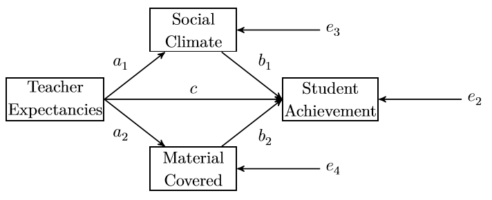

```{r setup, include=FALSE}
knitr::opts_chunk$set(echo = TRUE)

# See: https://stackoverflow.com/a/46526740/5252007.
def.chunk.hook  <- knitr::knit_hooks$get("chunk")
knitr::knit_hooks$set(chunk = function(x, options) {
    x <- def.chunk.hook(x, options)
    ifelse(options$size != "normalsize", paste0("\n \\", options$size, "\n\n", x, "\n\n \\normalsize"), x)
})

library(lavaan)
library(semPlot)
```

---

# Lab description

The exercises for this lab are meant to help you understand how to conduct
*path analysis* using the `lavaan` package in `R`. For this practical you will
need two packages: `lavaan` and `semPlot`. You can install and load these
packages using the following code:

```{r eval=FALSE, size='scriptsize'}
# Install packages.
install.packages(c("lavaan", "semPlot"))

# Load the packages.
library(lavaan)
library(semPlot)
```

# Lab exercises

## Exercise 1

@mackinnonIntroductionStatisticalMediation2008 [p. 113] provides a dataset from
a hypothetical study of teacher expectancies and student achievement (sample
size: $N = 40$). His path model is shown in Figure 1 and the covariances for the
model are given in Figure 2. Your first task is to solve the exercise proposed by
@beaujeanLatentVariableModeling2014. More specifically you are asked to:

a. Input the covariances into `R`.
    - Hint: consider using the `lavaan` function `lav_matrix_lower2full` to do
      this.
b. Write the syntax for the model.
    - Hint: use the `:=` operator to define both indirect effects from *teacher
      expectancies* to *student achievement* ($a_1 \times b_1$ and
      $a_2 \times b_2$).
c. What are the indirect effects?

<!-- Figure 1 !-->
{width=60%}

<!-- Figure 2 !-->
{width=80%}

\newpage

### Answers

We start by inputing the covariances in `R`.

```{r size='scriptsize'}
# Create the covariance matrix.
covariance_matrix <- lav_matrix_lower2full(
    c(84.85, 71.28, 140.34, 18.83, -6.25, 72.92, 60.05, 84.54, 37.18, 139.48)
)

# Write down the names of the variables.
#  - `TeachExp` stands for "teaching expectancies".
#  - `SocClim` stands for "social climate".
#  - `MatCov` stands for "material covered".
#  - `StAch` stands for "student achievement".
names <- c("TeachExp", "SocClim", "MatCov", "StAch")

# Add names to the rows and columns of the covariance matrix.
rownames(covariance_matrix) <- colnames(covariance_matrix) <- names

# Print the covariance matrix for inspection.
print(covariance_matrix)
```

Now that we have the covariance matrix, we can write down the model syntax in
`lavaan`. Note that we need to use the `:=` operator, which as presented in the
`lavaan` documentation:

> 'defines' new parameters which take on values that are an
> arbitrary function of the original model parameters. The function, however,
> must be specified in terms of the parameter labels that are explicitly
> mentioned in the model syntax.

```{r size='scriptsize'}
# The model syntax.
model_syntax <- '
    # Specify the regression equations and add labels.
    StAch ~ b1 * SocClim + b2 * MatCov + c * TeachExp
    MatCov ~ a2 * TeachExp
    SocClim ~ a1 * TeachExp

    # Specify the indirect effects.
    indirect1 := a1 * b1
    indirect2 := a2 * b2
'

# You can print the syntax to convince yourself that it's just text.
print(model_syntax)
```

And finally we can fit the model in order to obtain the parameter estimates.

```{r fig.align='center', size='scriptsize'}
# Fit the model.
fit <- sem(model_syntax, sample.cov = covariance_matrix, sample.nobs = 40)

# Visualize the model.
semPaths(fit, what = "path")

# Get fit summary.
summary(fit, standardized = TRUE)
```

The indirect effect through social climate is $0.478$.
The indirect effect through material covered is $0.118$.

---

## Exercise 2

In-class discussion of the code below and answer the following questions:

a. Is the model `multiple_mediation` just-identified, over-identified or under
   identified? Show calculations that proof your position.
b. How many degrees of freedom does the model `constrained_mediation` have?
   Motivate your answer.

<small>
    *The code is adapted from https://paolotoffanin.wordpress.com/2017/05/06/multiple-mediator-analysis-with-lavaan.*
</small>

### Answers

To answer **Exercise 2, point (a)** we need to look at the degrees of freedom
(DF). We can, of course, take them directly from the `lavaan` summary output,
but that wouldn't be any fun, so we calculate them ourselves based on the
following straightforward the formula:
$$ DF = \text{\# parameters} - \text{\# free parameters}, $$
where the symbol $\#$ stands for 'the number of'.

We proceed by first determining how many parameters are in the model (i.e., how
many elements are in the covariance matrix). We can calculate the number of
elements in the covariance matrix as follows:
$$ \text{\# parameters} = \frac{p \times (p + 1)}{2} , $$
where $p$ represents the number of variables in the model. In our case, this
translates to:
$$ \text{\# parameters} = \frac{4 \times (4 + 1)}{2} = 10 $$

Next, we determine how many free parameters (i.e., parameters that need to be
estimated) are in the model:

- 1 variance, 3 error variances
- 1 covariance (i.e., between the mediators)
- 5 structural path coefficients

In total that gives us $\text{\# free parameters} = 10$. Therefore, we have
$DF = 10 - 10$, i.e., $DF = 0$. In this case, we say that the model
`multiple_mediation` is just-identified as it contains $0$ degrees of freedom.

To answer **Exercise 2, point (b)** we need to understand that when adding a
constraint we are asking `lavaan` to estimate one fewer parameter. Therefore,
compared to the `multiple_mediation` model, the `constrained_mediation` model
has $1$ degrees of freedom (i.e., given by the constrain we set on the indirect
effects).

**Overview for the code below.**

The code below is used to fit and visualize a multiple mediation model. Then, we
pretend that we are interested in determining whether the two indirect effects
are significantly different. We test this scenario in three different ways:

1. First, in the `contrast_mediation` model we estimate a `contrast` parameter
   that is defined as the difference between the two indirect effects and we
   check the $p$-value provided by `lavaan` for that parameter.
2. Then, we estimate a new model `constrained_mediation` where we constraint the
   indirect effects to be equal (i.e., our null hypothesis). To test this
   hypothesis, we perform a Likelihood Ration Test (LRT) by comparing the
   `constrained_mediation` with the `multiple_mediation` model for which the
   constraint is not applied.
3. Finally, we can also investigate the difference between these two parameters
   by using the same approach as in the `contrast_mediation` scenario, but this
   time instructing `lavaan` to construct the standard errors based on
   bootstrapping, instead of relying on an assumption of normality. Then, we can
   consult the confidence intervals provided. In order to obtain valid results,
   make sure you use a sufficiently large number of bootstraps (e.g., $2000$ or
   more).

```{r eval=TRUE, fig.align='center', size='scriptsize'}

# Set the seed to be able to replicate the results.
set.seed(03101972)

# Simulate data with two mediators.
x <- rnorm(100)
m1 <- 0.65 * x + rnorm(100)
m2 <- -0.40 * x + rnorm(100)
y <- 0.77 * m2 + 0.45 * -m1 + rnorm(100)

# Put the variables together in a data frame.
data <- data.frame(x = x, y = y, m1 = m1, m2 = m2)

# Model syntax for the multiple mediation model.
multiple_mediation <- '
    y ~ b1 * m1 + b2 * m2 + c * x
    m1 ~ a1 * x
    m2 ~ a2 * x

    # Allow for covariance between the mediators (i.e., as in Preacher and Hayes, 2008).
    m1 ~~ m2

    # Indirect effects.
    indirect1 := a1 * b1
    indirect2 := a2 * b2

    # Total effect.
    total := c + (a1 * b1) + (a2 * b2)
'

# Fit the model.
fit_mediation <- sem(model = multiple_mediation, data = data)

# Visualize the model.
semPaths(fit_mediation, what = "path", whatLabels = "label")

# We can also see the values of the estimated parameters instead of the labels.
semPaths(fit_mediation, what = "path", whatLabels = "par")

# Extract fit statistics.
summary(fit_mediation)
```

Now include a contrast in the model to test the null hypothesis that the
indirect effects are equal to each other.

```{r eval=TRUE, fig.align='center', size='scriptsize'}
# Model syntax for multiple mediation model with contrast.
contrast_mediation <- '
    y  ~ b1 * m1 + b2 * m2 + c * x
    m1 ~ a1 * x
    m2 ~ a2 * x

    # Allow for covariance between the mediators.
    m1 ~~ m2

    # Indirect effects.
    indirect1 := a1 * b1
    indirect2 := a2 * b2

    # Total effect.
    total := c + (a1 * b1) + (a2 * b2)

    # Contrast.
    contrast := indirect1 - indirect2
'

# Fit the model.
fit_contrast_mediation <- sem(model = contrast_mediation, data = data)

# Extract fit statistics.
summary(fit_contrast_mediation)
```

Finally, add a constraint in the multiple mediation model specifying the two
indirect effect to be equal.

```{r eval=TRUE, fig.align='center', size='scriptsize'}
constrained_mediation <- '
    y ~ b1 * m1 + b2 * m2 + c * x
    m1 ~ a1 * x
    m2 ~ a2 * x

    # Allow for covariance between the mediators.
    m1 ~~ m2

    # Indirect effects.
    indirect1 := a1 * b1
    indirect2 := a2 * b2

    # Total effect.
    total := c + (a1 * b1) + (a2 * b2)

    # Equality constraint.
    indirect1 == indirect2
'

# Fit the model.
fit_constrained_mediation <- sem(model = constrained_mediation, data = data)

# Visualize the model.
semPaths(fit_constrained_mediation, what = "path", whatLabels = "par")

# Extract fit statistics and check that the constrain is satisfied.
summary(fit_constrained_mediation)
```

Test if the constrained model fits equally well as the model without the equality
constraint using a Likelihood-Ratio Test (LRT). We can perform a LRT for two
models fited with `lavaan` in `R` using the `anova` function.

```{r eval=TRUE, fig.align='center', size='scriptsize'}
# Perform LRT.
anova(fit_mediation, fit_constrained_mediation)
```

```{r eval=TRUE, size='scriptsize'}

# Note, you should use a sufficiently large number of bootstraps.
fit <- sem(
    model = contrast_mediation,
    data  = data,
    se = "bootstrap",
    bootstrap = 2000
)

# Extract information.
summary(
    fit, fit.measures = TRUE, standardize = TRUE,
    rsquare = TRUE, estimates = TRUE, ci = TRUE
)
```

\newpage

# References
