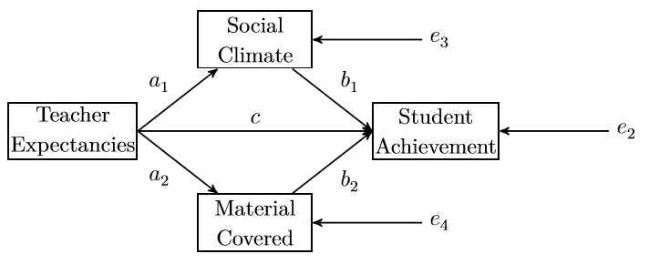
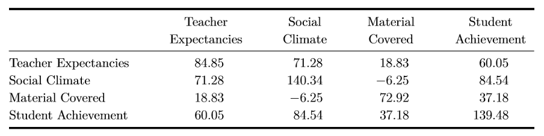

```{r setup, include=FALSE}
knitr::opts_chunk$set(echo = TRUE)

library(lavaan)
library(semPlot)
```

---

# Lab description

The exercises for this lab are meant to help you understand how to conduct
*path analysis* using the `lavaan` package in `R`. For this practical you will
need two packages: `lavaan` and `semPlot`. You can install and load these
packages using the following code:

```{r eval=FALSE}
# Install packages.
install.packages(c("lavaan", "semPlot"))

# Load the packages.
library(lavaan)
library(semPlot)
```

## Exercise 1

@mackinnonIntroductionStatisticalMediation2008 [p. 113] provides a dataset from
a hypothetical study of teacher expectancies and student achievement (sample
size: $N = 40$). His path model is shown in Figure 1 and the covariances for the
model are given in Figure 2. Your first task is to solve the exercise proposed by
@beaujeanLatentVariableModeling2014. More specifically you are asked to:

a. Input the covariances into `R`.
    - Hint: consider using the `lavaan` function `lav_matrix_lower2full` to do
      this.
b. Write the syntax for the model.
    - Hint: use the `:=` operator to define both indirect effects from *teacher
      expectancies* to *student achievement* ($a_1 \times b_1$ and
      $a_2 \times b_2$).
c. What are the indirect effects?

<!-- Figure 1 !-->
{width=60%}

<!-- Figure 2 !-->
{width=80%}

\newpage

## Exercise 2

In-class discussion of the code below and answer the following questions:

a. Is the model `multiple_mediation` just-identified, over-identified or under
   identified? Show calculations that proof your position.
b. How many degrees of freedom does the model `constrained_mediation` have?
   Motivate your answer.

<small>
    *The code is adapted from https://paolotoffanin.wordpress.com/2017/05/06/multiple-mediator-analysis-with-lavaan.*
</small>

```{r eval=FALSE}

# Set the seed to be able to replicate the results.
set.seed(03101972)

# Simulate data with two mediators.
x <- rnorm(100)
m1 <- 0.65 * x + rnorm(100)
m2 <- -0.40 * x + rnorm(100)
y <- 0.77 * m2 + 0.45 * -m1 + rnorm(100)

# Put the variables together in a data frame.
data <- data.frame(x = x, y = y, m1 = m1, m2 = m2)

# Model syntax for the multiple mediation model.
multiple_mediation <- '
    y ~ b1 * m1 + b2 * m2 + c * x
    m1 ~ a1 * x
    m2 ~ a2 * x

    # Allow for covariance between the mediators (i.e., as in Preacher and Hayes, 2008).
    m1 ~~ m2

    # Indirect effects.
    indirect1 := a1 * b1
    indirect2 := a2 * b2

    # Total effect.
    total := c + (a1 * b1) + (a2 * b2)
'

# Fit the model.
fit_mediation <- sem(model = multiple_mediation, data = data)

# Visualize the model.
semPaths(fit_mediation, what = "path", whatLabels = "label")

# We can also see the values of the estimated parameters instead of the labels.
semPaths(fit_mediation, what = "path", whatLabels = "par")

# Extract fit statistics.
summary(fit_mediation)
```

Now include a contrast in the model to test the null hypothesis that the
indirect effects are equal to each other.

```{r eval=FALSE}

# Model syntax for multiple mediation model with contrast.
contrast_mediation <- '
    y  ~ b1 * m1 + b2 * m2 + c * x
    m1 ~ a1 * x
    m2 ~ a2 * x

    # Allow for covariance between the mediators.
    m1 ~~ m2

    # Indirect effects.
    indirect1 := a1 * b1
    indirect2 := a2 * b2

    # Total effect.
    total := c + (a1 * b1) + (a2 * b2)

    # Contrast.
    contrast := indirect1 - indirect2
'

# Fit the model.
fit_contrast_mediation <- sem(model = contrast_mediation, data = data)

# Extract fit statistics.
summary(fit_contrast_mediation)
```

Finally, add a constraint in the multiple mediation model specifying the two
indirect effect to be equal.

```{r eval=FALSE}
constrained_mediation <- '
    y ~ b1 * m1 + b2 * m2 + c * x
    m1 ~ a1 * x
    m2 ~ a2 * x

    # Allow for covariance between the mediators.
    m1 ~~ m2

    # Indirect effects.
    indirect1 := a1 * b1
    indirect2 := a2 * b2

    # Total effect.
    total := c + (a1 * b1) + (a2 * b2)

    # Equality constraint.
    indirect1 == indirect2
'

# Fit the model.
fit_constrained_mediation <- sem(model = constrained_mediation, data = data)

# Visualize the model.
semPaths(fit_constrained_mediation, what = "path", whatLabels = "par")

# Extract fit statistics and check that the constrain is satisfied.
summary(fit_constrained_mediation)
```

Test if the constrained model fits equally well as the model without the equality
constraint using a Likelihood-Ratio Test (LRT). We can perform a LRT for two
models fited with `lavaan` in `R` using the `anova` function.

```{r eval=FALSE}
# Perform LRT.
anova(fit_mediation, fit_constrained_mediation)
```

```{r eval=FALSE}
fit <- sem(
    model = contrast_mediation,
    data  = data,
    se = "bootstrap",
    bootstrap = 10
)

# Extract information.
summary(
    fit, fit.measures = TRUE, standardize = TRUE,
    rsquare = TRUE, estimates = TRUE, ci = TRUE
)
```

\newpage

# References
