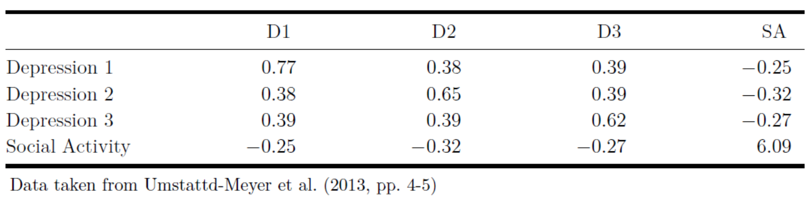
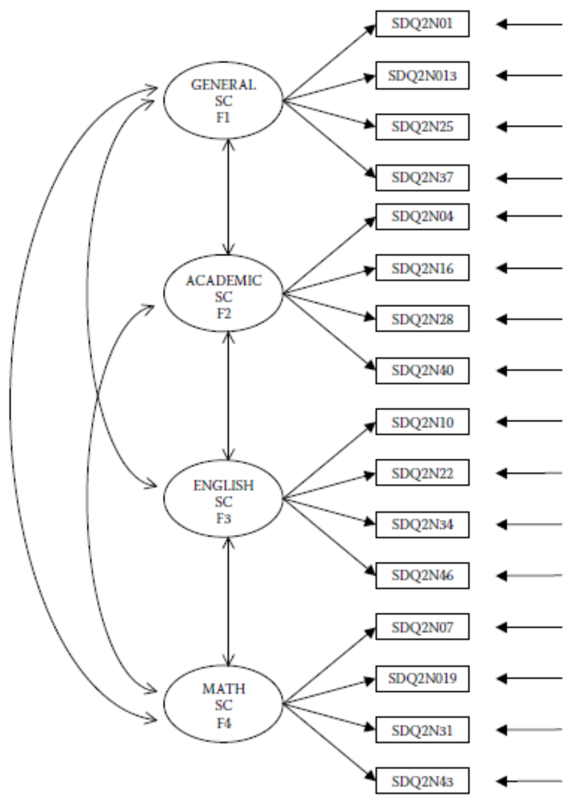

```{r setup, include=FALSE}
knitr::opts_chunk$set(echo = TRUE)

# Reduce code chunk and output size.
# See: https://stackoverflow.com/a/46526740/5252007.
def.chunk.hook  <- knitr::knit_hooks$get("chunk")
knitr::knit_hooks$set(chunk = function(x, options) {
    x <- def.chunk.hook(x, options)
    ifelse(options$size != "normalsize", paste0("\n \\", options$size, "\n\n", x, "\n\n \\normalsize"), x)
})

# Store the path.
path <- getwd()

# Load libraries.
library(lavaan)
library(semPlot)
library(corrplot)

# Load data.
data <- read.csv(paste0(path, "/data/ASC7INDM.csv"))
```

---

# Lab Description

For this practical you will need the following packages: `lavaan` and `semPlot`.
You can install and load these packages using the following code:

```{r size="footnotesize", eval=FALSE}
# Install packages.
install.packages(c("lavaan", "semPlot"))

# Load the packages.
library(lavaan)
library(semPlot)
```

## Exercise 1

@umstattdmeyerPredictorsOlderAdults2014 measured poor psychosocial health as a
single factor model using three item facets from a depression questionnaire and
a measure of social activity. The covariance matrix is given in Figure 1.

<!-- Figure 1 !-->
{width=80%}

a. Enter the covariance matrix into `R`.

```{r size="footnotesize"}
# Input the covariance matrix.
covariances <- c(0.77, 0.38, 0.65, 0.39, 0.39, 0.62, -0.25, -0.32, -0.27, 6.09)

# Create the covariance matrix using "lavaan::lav_matrix_lower2full".
covariances <- lav_matrix_lower2full(covariances)

# Add row and column names for the variables.
# Dep1 stands for "Depresion 1".
# Dep2 stands for "Depresion 2".
# Dep3 stands for "Depresion 3".
# SocAct stands for "Social Activity".
rownames(covariances) <- colnames(covariances) <- c("Dep1", "Dep2", "Dep3", "SocAct")
```

b. Fit the model using (1) the marker variable approach, (2) the standardized
   latent variable approach, and (3) the effect coding approach for achieving
   identification of the latent variable. For the marker variable method, use
   `Depression 1` as the marker variable. The resulting $\chi^2$ and degrees of
   freedom (DF) should be identical for the three models.

**Using (1) the marker variable approach.**

```{r size="footnotesize"}
# Model syntax.
# `PsychoSocial` (i.e., psychosocial health) in the name we selected for the latent construct.
model_marker <- "
    PsychoSocial =~ Dep1 + Dep2 + Dep3 + SocAct
"

# Model fit.
model_marker_fit <- cfa(model_marker, sample.cov = covariances, sample.nobs = 6053)

# Model summary.
summary(model_marker_fit, standardized = TRUE)
```

**Using (2) the standardized latent variable approach.**

```{r size="footnotesize"}
# Model syntax.
model_stdlv <- "
    PsychoSocial =~ NA * Dep1 + Dep1 + Dep2 + Dep3 + SocAct
    PsychoSocial ~~ 1 * PsychoSocial
"

# Model fit.
model_stdlv_fit_1 <- cfa(model_stdlv, sample.cov = covariances, sample.nobs = 6053)

# Model summary.
summary(model_stdlv_fit_1, standardized = TRUE)
```

Instead of tweaking the model syntax, we can also indicate that we want to
standardize the latent variable by setting the `std.lv = TRUE` argument in
`lavaan::cfa`. In this case, we use the model syntax `model_marker`.

```{r size="footnotesize"}
# Model fit using standardized latent variable approach via `std.lv = TRUE`.
model_stdlv_fit_2 <- cfa(
    model_marker,
    sample.cov = covariances,
    std.lv = TRUE,
    sample.nobs = 6053
)

# Model summary.
summary(model_stdlv_fit_2, standardized = TRUE)
```

Both ways of standardizing the latent variable show in the output that the
variance of the latent variable `PsychoSocial` has a variance of $1$.
Furthermore, model fit is identical to marker variable approach (i.e., $\chi^2 =
9.620$).

**Using (3) the effect coding approach.**

```{r size="footnotesize"}
# Model syntax.
model_effect_coding <- "
    PsychoSocial =~
        NA * Dep1 +
        LoadingDep1 * Dep1 +
        LoadingDep2 * Dep2 +
        LoadingDep3 * Dep3 +
        LoadingSocAct * SocAct

    # Effect coding.
    LoadingDep1 == 4 - LoadingDep2 - LoadingDep3 - LoadingSocAct
"

# Model fit.
model_effect_coding_fit <- cfa(model_effect_coding, sample.cov = covariances, sample.nobs = 6053)

# Summary.
summary(model_effect_coding_fit, standardized = TRUE)

# Extract the values for the loadings.
loadings <- coef(model_effect_coding_fit)[1:4]

# Compute the mean for the loadings.
mean(loadings)
```

Again, we see that model fit is identical to the marker and standardized latent
variables approaches. Latent variable is on the same scale as the average of all
the indicators (i.e., optimally weighted average of set of indicators). Average
of the loadings equals $\frac{1.744 + 1.753 + 1.787 - 1.284}{4} = 1$. The
variance of `PsychoSocial` latent variable is $0.125$, and it represents the
average of the amount of reliable variance that each indicator contributes to
the definition of this latent construct.

c. Re-estimate the the first model (i.e., using the marker variable method), but
   now with the additional equality constraints between the loadings of
   `Depression 1`, `Depression 2`, and `Social Activity`.

```{r size="footnotesize"}
# Model syntax with equality constraint.
model_marker_constrained <- "
    PsychSocLV =~ c1 * Dep1 + c1 * Dep2 + Dep3 + c1 * SocAct
"

# Model fit.
model_marker_constrained_fit <- cfa(model_marker_constrained, sample.cov = covariances, sample.nobs = 6053)

# Model summary.
summary(model_marker_constrained_fit)
```

d. Test the constrained against the unconstrained marker model using the
   likelihood ratio test. What do you conclude?

```{r size="footnotesize"}
# Perform a likelihood ratio test using the `anova` function in `R`.
anova(model_marker_constrained_fit, model_marker_fit)
```

We see that the constrained model fits worse than unconstrained model, hence we
prefer the unconstrained model.

<!-- Page break -->
\newpage

## Exercise 2

Consider the following hypothesized four-factor CFA model of self-concept
depicted in Figure 2.

<!-- Figure 2 !-->
{width=70%}

a. Using the data that are stored in the dataset `ASC7INDM.csv` with $N = 265$,
estimate this model and evaluate its fit using the MFTS statistic reported by
`lavaan`. Use the marker variable approach to identify the scale of the latent
variables.

Set the working directory to the location where your data file has been
downloaded and load the data.

```{r size="footnotesize", eval=FALSE}
# For example.
setwd("/Users/mihai/Downloads")

# Load data.
data <- read.csv("ASC7INDM.csv")

# Inspect the data.
View(data)

# Or quickly list the variables.
str(data)

# Or summarize the data.
summary(data)
```

*Optional*. When working with new datasets, it can also help to have a bird's
eye view on the correlation structure of the data. We can use the `corrplot`
package to obtain such a plot, which we can install and load as follows:

```{r size="footnotesize", eval=FALSE}
# Install the `corrplot` package.
install.packages("corrplot")

# Load the package.
library(corrplot)
```

Now, we can obtain our correlation plot as follows:

```{r size="footnotesize", dev="pdf", fig.width=12, fig.height=12, out.width="450px", fig.align="center"}
# Compute correlations between all pair of variables.
corrs <- cor(data)

# Plot the correlations.
# Tip: make sure you open your plot in a new window to get a better view.
corrplot(corrs)
```

Or, we can obtain the same correlation plot just for the variables we are
interested in (i.e., the indicator variables depicted in Figure 2).

```{r size="footnotesize", dev="pdf", fig.width=12, fig.height=12, out.width="450px", fig.align="center"}
# Write down the names of the variables we are interested in.
names <- c(
    "SDQ2N01", "SDQ2N13", "SDQ2N25", "SDQ2N37",
    "SDQ2N04", "SDQ2N16", "SDQ2N28", "SDQ2N40",
    "SDQ2N10", "SDQ2N22", "SDQ2N34", "SDQ2N46",
    "SDQ2N07", "SDQ2N19", "SDQ2N31", "SDQ2N43"
)

# Compute the correlations only for the variables listed in `names`.
corrs_variables <- cor(data[, names])

# Plot the correlations.
corrplot(corrs_variables)
```

Now that we've loaded and inspected the data, we can continue with fitting the
model depicted in Figure 2. Note that for identification purposes we will use
the marker variable approach.

```{r size="footnotesize", dev="pdf", fig.width=20, fig.height=9, out.width="450px", fig.align="center"}
# Model syntax.
model_self_concept <- "
    # Measurement model.
    F1 =~ SDQ2N01 + SDQ2N13 + SDQ2N25 + SDQ2N37
    F2 =~ SDQ2N04 + SDQ2N16 + SDQ2N28 + SDQ2N40
    F3 =~ SDQ2N10 + SDQ2N22 + SDQ2N34 + SDQ2N46
    F4 =~ SDQ2N07 + SDQ2N19 + SDQ2N31 + SDQ2N43

    # Covariances between latent variables.
    F1 ~~ F2
    F1 ~~ F3
    F1 ~~ F4
    F2 ~~ F3
    F2 ~~ F4
    F3 ~~ F4
"

# Model fit.
model_self_concept_fit <- cfa(model_self_concept, data = data)

# Visualize the model.
semPaths(model_self_concept_fit, what = "paths", whatLabels = "est", sizeMan = 4)

# Model summary.
summary(model_self_concept_fit)
```

We obtain a $\chi^2 = 159.112$ with $DF = 98$ and a $p\text{-value} < 0.001$.
The *null hypothesis* that the model implied covariance matrix fits the
population covariance matrix must be rejected. You do not want to reject the
null hypothesis (i.e., you want a $p$-value above a certain $alpha$).

*Note.* The covariances between the latent variables are estimated by default
when using `lavaan`. These covariances were added in the syntax above just to
illustrate how this is done.

b. According to the `lavaan` results, this model has $98$ degrees of freedom.
Show calculations that clarify why this model has $98$ degrees of freedom.

The variance-covariance matrix $\Sigma$ has $\frac{16 \times (16 + 1)}{2} = 136$
elements. In the model we have $38$ parameters:

- $16$ variances of error terms
- $4$ variances of latent variables
- $6$ covariances
- $12$ loadings (i.e., not $16$ because we implement $4$ marker constraints)

We compute the degrees of freedom as
$$ DF = \text{\# parameters} - \text{\# free parameters} $$
and obtain $136 - 38 = 98$.

c. Which possibilities do you have to possibly improve the fit of the model?

Ways to possibly improve model fit:

- include cross-loadings
- include error covariances,
- constrain parameters to certain values


We may also add equality constraints, or constrain non-significant loadings and/
or covariances to $0$. However, this will not improve the fit, it will only
ensure that the model fit will not become worse.

<!-- Page break -->
\newpage

# References
