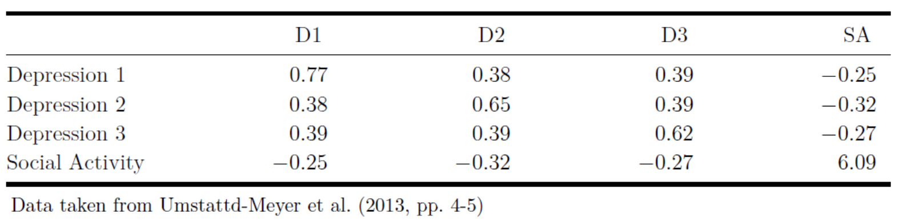
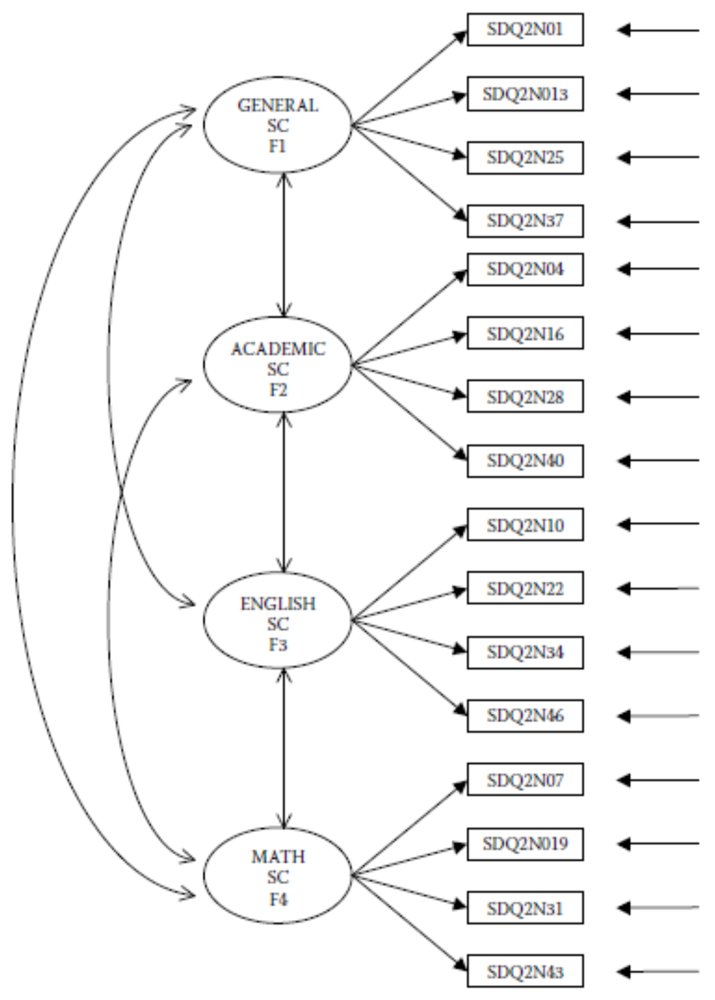

```{r setup, include=FALSE}
knitr::opts_chunk$set(echo = TRUE)

setwd("/Users/mihai/OneDrive/School/Teaching/Structural Equation Modeling - ReMa - Tilburg/2021/Lecture 03 - Model Parameters/Practical")

library(lavaan)
```

---

## Exercise 1

@umstattdmeyerPredictorsOlderAdults2014 measured poor psychosocial health as a
single factor model using three item facets from a depression questionnaire and
a measure of social activity. The covariance matrix is given in Figure 1.

a. Enter the covariance matrix into `R`.

b. Fit the model using (1) the marker variable approach, (2) the standardized
   latent variable approach, and (3) the effect coding approach for achieving
   identification of the latent variable. For the marker variable method, use
   `Depression 1` as the marker variable. The resulting $\chi^2$ and degrees of
   freedom (DF) should be identical for the three models.

c. Re-estimate the the first model (i.e., using the marker variable method), but
   now with the additional equality constraints between the loadings of
   `Depression 1`, `Depression 2`, and `Social Activity`.

d. Test the constrained against the unconstrained marker model using the
   likelihood ratio test. What do you conclude?

<!-- Figure 1 !-->
{width=80%}

<!-- Page break -->
\newpage

## Exercise 2

Consider the following hypothesized four-factor CFA model of self-concept
depicted in Figure 2.

a. Using the data that are stored in the dataset `ASC7INDM.csv` with $N = 265$,
estimate this model and evaluate its fit using the MFTS statistic reported by
`lavaan`. Use the marker variable approach to identify the scale of the latent
variables.

b. According to the `lavaan` results, this model has $98$ degrees of freedom.
Show calculations that clarify why this model has $98$ degrees of freedom.

c. Which possibilities do you have to possibly improve the fit of the model?

<!-- Figure 1 !-->
{width=70%}

<!-- Page break -->
\newpage

# References #
