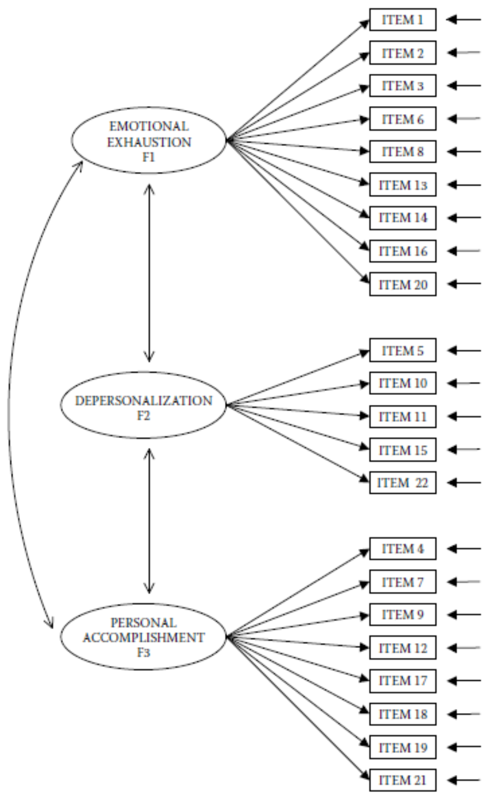

```{r setup, include=FALSE}
knitr::opts_chunk$set(echo = TRUE)

# Reduce code chunk and output size.
# See: https://stackoverflow.com/a/46526740/5252007.
def.chunk.hook  <- knitr::knit_hooks$get("chunk")
knitr::knit_hooks$set(chunk = function(x, options) {
    x <- def.chunk.hook(x, options)
    ifelse(options$size != "normalsize", paste0("\n \\", options$size, "\n\n", x, "\n\n \\normalsize"), x)
})

# Set the path only for interactive sessions.
if (interactive()) setwd("./Practical 04 - Estimation Methods in SEM")

# Load libraries.
library(lavaan)
library(semPlot)
library(psych)
library(ggplot2)

# Load the data.
data_ex_1 <- read.csv("./data/ELEMM1.csv")
data_ex_2 <- read.csv("./data/bdihk2c2.csv")
```

---

# Lab Description

For this practical you will need the following packages:

- `lavaan`
- `semPlot`
- `psych`
- `ggplot2`

You can install and load these packages using the following code:

```{r size="footnotesize", eval=FALSE}
# Install packages.
install.packages(c("lavaan", "semPlot", "psych", "ggplot2"))

# Load the packages.
library(lavaan)
library(semPlot)
library(psych)
library(ggplot2)

```

## Exercise 1

Upon installing the `R` packages mentioned above perform the following:

b. Import the dataset `ELEMM1.csv` that is available in the folder for this
   practical on Canvas.

Set the working directory to the location where your data file has been
downloaded and load the data.

```{r size="footnotesize", eval=FALSE}
# For example.
setwd("/Users/mihai/Downloads")

# Load data.
data_ex_1 <- read.csv("ELEMM1.csv")

# Inspect the data.
View(data_ex_1)
```

Quickly list the variables and their names.

```{r size="footnotesize"}
# List the variables.
str(data_ex_1)
```

c. Inspect the *skewness* and *kurtosis* of `ITEM1` to `ITEM22` using the
   `psych` package. Do you see indications of severe deviations from
   normality?

Check out the documentation for the package `psych` on how to compute
descriptive measures for your variables by running `??psych`. We can use the
function `psych::describe`.

```{r size="footnotesize"}
# Describe the data using `psych`.
describe(data_ex_1)
```

There seems to be some indication of non-normality, but not too severe. This may
warrant using a robust estimator.

d. Estimate the model in Figure 1 using the default Maximum Likelihood method.

```{r size="footnotesize", dev="pdf", fig.width=20, fig.height=9, out.width="450px", fig.align="center"}
# Model syntax.
model_ex_1 <- "
    EMO =~ ITEM1 + ITEM2  + ITEM3  + ITEM6  + ITEM8  + ITEM13 + ITEM14 + ITEM16 + ITEM20
    DEP =~ ITEM5 + ITEM10 + ITEM11 + ITEM15 + ITEM22
    ACC =~ ITEM4 + ITEM7  + ITEM9  + ITEM12 + ITEM17 + ITEM18 + ITEM19 + ITEM21

    # Covariances between latent variables
    EMO ~~ DEP
    DEP ~~ ACC
    EMO ~~ ACC
"

# Estimate the model.
model_ex_1_fit_ml <- cfa(model_ex_1, data = data_ex_1, estimator = "ML")

# Visualize the model.
semPaths(model_ex_1_fit_ml, what = "paths", sizeMan = 3)

# Model summary for the `ML` estimator.
summary(model_ex_1_fit_ml)
```

e. Re-estimate the model, but now use the Satorra-Bentler estimator to estimate
   the *MFTS*. How does the scaling factors relate to the unscaled $\chi^2$
   value?

Now we are going to re-estimate the model using Maximum Likelihood with robust
standard errors (SE) and a Satorra-Bentler scaled test statistic (i.e.,
$\chi^2$). The estimator we are interested in is called `MLM` in `lavaan`.

```{r size="footnotesize"}
# Re-estimate the model.
model_ex_1_fit_mlm <- cfa(model_ex_1, data = data_ex_1, estimator = "MLM")

# Model summary.
summary(model_ex_1_fit_mlm)
```

The Satorra-Bentler method adjusts the $\chi^2$ downwards because due to
non-normality it is otherwise overestimated. In other words, it takes into
account kurtosis.

To obtain roughly the same *MFTS* (i.e., $\chi^2$) we observed when we
used `estimator = "ML"` we need
$\text{Satorra-Bentler MFTS} \times \text{scaling correction factor}$

f. Evaluate the fit of the model estimated in (e).

We observe a $\chi^2 = 567.753$ with $DF = 206$ and a $p\text{-value} < 0.001$.
Hypothesis that model exactly reproduces data must be rejected.

<!-- Figure 1 !-->
{width=80%}

<!-- Page break -->
\newpage

## Exercise 2

a. Import the dataset `bdihk2c2.csv` that is available in the folder for this
   practical on Canvas.

Set the working directory to the location where your data file has been
downloaded and load the data.

```{r size="footnotesize", eval=FALSE}
# For example.
setwd("/Users/mihai/Downloads")

# Load data.
data_ex_2 <- read.csv("bdihk2c2.csv")

# Inspect the data.
View(data_ex_2)
```

Quickly list the variables and their names.

```{r size="footnotesize"}
# List the variables.
str(data_ex_2)
```

b. Inspect the *skewness* and *kurtosis* of `BDI2_1` to `BDI2_20` using the
   `psych` package. Do you see indications of severe deviations from
   normality?

We can again use the `describe` function in the `psych` package.

```{r size="footnotesize"}
# Describe the data using `psych`.
describe(data_ex_2)
```

It looks like we see some signs of non-normality.

c. Develop histograms (using the `ggplot2` package) for the variables `BDI2_1`
   and `BDI2_20`. What do you learn from the inspection of these histograms?
   - *Tip: When working with `R` you will often encounter parts that you just
     don't know how to implement, so don't be ashamed to Google things (e.g.,
     "how to create and histogram using `ggplot2` in `R`").*

```{r size="footnotesize", dev="pdf", fig.width=6, fig.height=4, out.width="250px", fig.align="center"}
# Histogram for variable `BDI2_1`.
ggplot(data = data_ex_2) +
    geom_histogram(mapping = aes(BDI2_1), bins = 10) +
    theme_bw()

# Histogram for variable `BDI2_2`.
ggplot(data = data_ex_2) +
    geom_histogram(mapping = aes(BDI2_2), bins = 10) +
    theme_bw()

# Or you can also use the built-in function `hist` in `R` for this.
# Histogram for `BDI2_1` using `hist`
hist(data_ex_2$BDI2_1)

# Histogram for `BDI2_2` using `hist`
hist(data_ex_2$BDI2_12)
```

d. Estimate the model in Figure 2, but with the following additional constraints
   and model estimation specifications:
   1. Use `BDI2_3`, `BDI2_12`, and `BDI2_16` as marker variables.
   2. Constrain the variances of `F1`, `F2`, and `F3` to be equal.
   3. Fix the variance of `F4` to $1$.
   4. Define the observed variables as ordered categorical variables.
   5. Use as estimator the *Mean and Variance Adjusted Weighted Least Squares*
      estimator (WLSMV).
   6. Evaluate the fit of this model.

*Note:* variables miss a `C` in the labeling, so `CBD` in picture is `BD` in the
dataset.

First, we specify the model syntax.

```{r size="footnotesize"}
# Model syntax.
model_ex_2 <- "
    # Measurement model.
    F1 =~ NA * BDI2_1 + BDI2_2 + 1 * BDI2_3 + BDI2_5 + BDI2_6 + BDI2_7 + BDI2_8 + BDI2_9 + BDI2_10 + BDI2_14
    F2 =~ NA * BDI2_4 + BDI2_11 + 1 * BDI2_12 + BDI2_13 + BDI2_17 + BDI2_19
    F3 =~ NA * BDI2_15 + 1 * BDI2_16 + BDI2_18 + BDI2_20

    # Structural model.
    F4 =~ NA * F1 + F2 + F3

    # Constrain the variance of the structural factor to 1.
    F4 ~~ 1 * F4

    # Add labels for the variances of the latent variables.
    F1 ~~ a1 * F1
    F2 ~~ a2 * F2
    F3 ~~ a3 * F3

    # Constrain the variances of the latent variables to be equal.
    a1 == a2
    a1 == a3
    a2 == a3
"
```

*What other shorter syntax would allow us to constrain the variances of the
latent variables?*

Now we can estimate the model using the `ML` approach.

```{r size="footnotesize", dev="pdf", fig.width=20, fig.height=9, out.width="450px", fig.align="center"}
# Estimate the model using the `ML` approach.
model_ex_2_fit_ml <- cfa(model_ex_2, data = data_ex_2)

# Visualize the model.
semPaths(model_ex_2_fit_ml, what = "paths", sizeMan = 3)

# Model summary.
summary(model_ex_2_fit_ml)
```

Now we can specify which variables should be treated as ordered variables and
use the `WLSMV` estimator. First, let's store the names of those variables in a
vector for convenience.

```{r size="footnotesize"}
# Store the variable names.
ordinal_variables_ex_2 <- c(
    "BDI2_1", "BDI2_2", "BDI2_3", "BDI2_4",
    "BDI2_5", "BDI2_6", "BDI2_7", "BDI2_8",
    "BDI2_9", "BDI2_10", "BDI2_11", "BDI2_12",
    "BDI2_13", "BDI2_14", "BDI2_15", "BDI2_16",
    "BDI2_17", "BDI2_18", "BDI2_19", "BDI2_20"
)

# Print the variable names.
print(ordinal_variables_ex_2)
```

Estimate the model using the `WLSMV` estimator and use the variables names
stored in `ordinal_variables_ex_2` to indicate to `lavaan` which variables
should be treated as ordinal.

```{r size="footnotesize"}

# Estimate the model using the `WLSMV` estimator.
model_ex_2_fit_wlsmv <- cfa(
    model_ex_2,
    data = data_ex_2,
    ordered = ordinal_variables_ex_2,
    estimator = "WLSMV"
)

# Model summary.
summary(model_ex_2_fit_wlsmv)
```

The hypothesis that model exactly reproduces data must be rejected.

*As you may have noticed, for some of the fit indices we also have a *robust*
version. Check out this question for more information:
https://stats.stackexchange.com/q/241896/116619.*

{width=80%}
