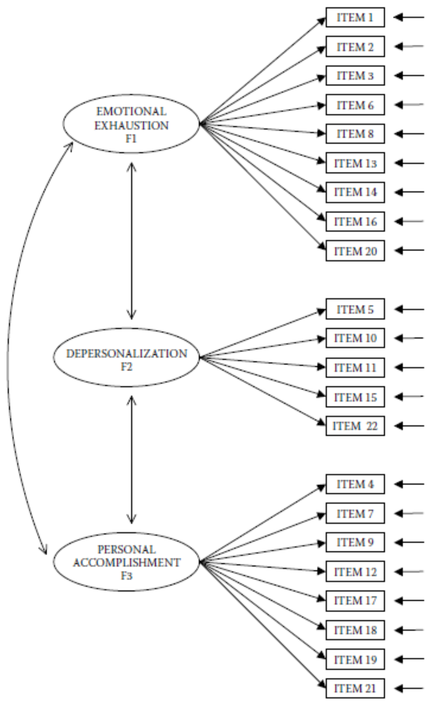
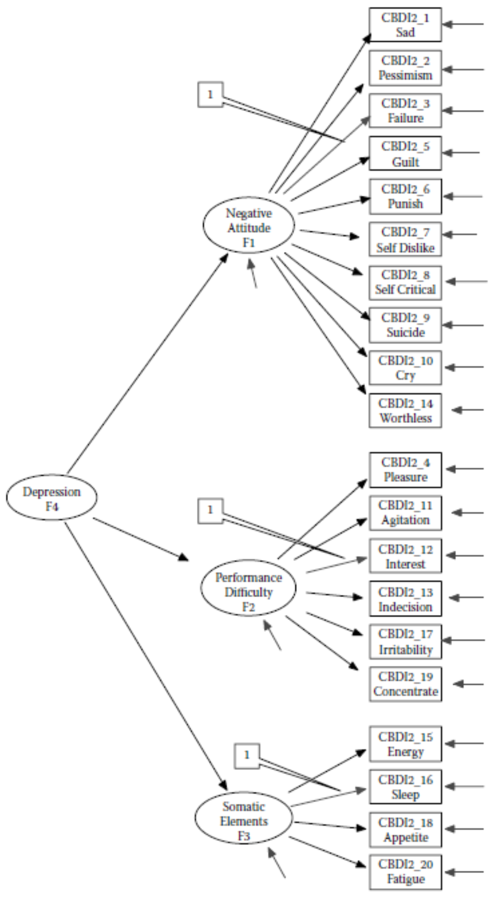

```{r setup, include=FALSE}
knitr::opts_chunk$set(echo = TRUE)

# Reduce code chunk and output size.
# See: https://stackoverflow.com/a/46526740/5252007.
def.chunk.hook  <- knitr::knit_hooks$get("chunk")
knitr::knit_hooks$set(chunk = function(x, options) {
    x <- def.chunk.hook(x, options)
    ifelse(options$size != "normalsize", paste0("\n \\", options$size, "\n\n", x, "\n\n \\normalsize"), x)
})

# Store the path.
path <- "/Users/mihai/OneDrive/School/Teaching/Structural Equation Modeling - ReMa - Tilburg/2021/Lecture 04 - Estimation Methods in SEM/Practical"

# Set the path.
setwd(path)
```

---

# Lab Description

For this practical you will need the following packages:

- `lavaan`
- `semPlot`
- `psych`
- `ggplot2`

You can install and load these packages using the following code:

```{r size="footnotesize", eval=FALSE}
# Install packages.
install.packages(c("lavaan", "semPlot", "psych", "ggplot2"))

# Load the packages.
library(lavaan)
library(semPlot)
library(psych)
library(ggplot2)

```

## Exercise 1

Upon installing the `R` packages mentioned above perform the following:

b. Import the dataset `ELEMM1.csv` that is available in the folder for this
   practical on Canvas.

c. Inspect the *skewness* and *kurtosis* of `ITEM1` to `ITEM22` using the
   `psych` package. Do you see indications of severe deviations from
   normality?

d. Estimate the model in Figure 1 using the default Maximum Likelihood method.

e. Re-estimate the model, but now use the Satorra-Bentler estimator to estimate
   the *MFTS*. How does the scaling factors relate to the unscaled $\chi^2$
   value?

f. Evaluate the fit of the model estimated in (e).


<!-- Figure 1 !-->
{width=80%}

<!-- Page break -->
\newpage

## Exercise 2

a. Import the dataset `bdihk2c2.csv` that is available in the folder for this
   practical on Canvas.

b. Inspect the *skewness* and *kurtosis* of `BDI2_1` to `BDI2_20` using the
   `psych` package. Do you see indications of severe deviations from
   normality?

c. Develop histograms (using the `ggplot2` packages) for the variables. What do
   you learn from the inspection of these histograms?
   - *Tip: When working with `R` you will often encounter parts that you just
     don't know how to implement, so don't be ashamed to Google things (e.g.,
     "how to create and histogram using `ggplot2` in `R`").*

d. Estimate the model in Figure 2, but with the following addition constraints
   and model estimation specifications:
   1. Use `BDI2_3`, `BDI2_12`, and `BDI2_16` as marker variables.
   2. Constraint the variances of `F1`, `F2`, and `F3` to be equal.
   3. Fix the variance of `F4` to $1$.
   4. Define the observed variables as ordered categorical variables.
   5. Use as estimator the *Mean and Variance Adjusted Weighted Least Squares*
      estimator (WLSMV).
   6. Evaluate the fit of this model.

*Note:* variables miss a `C` in the labeling, so `CBD` in picture is `BD` in the
dataset.

{width=80%}
