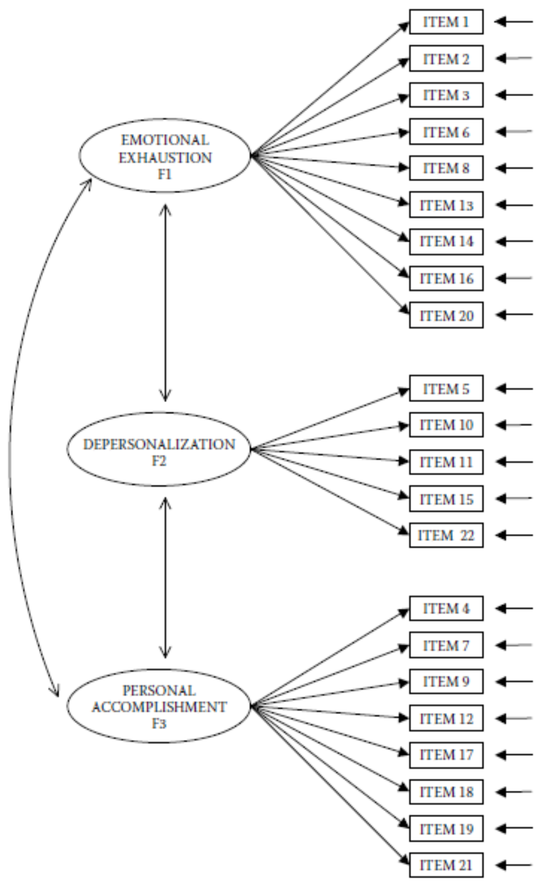

```{r setup, include=FALSE}
knitr::opts_chunk$set(echo = TRUE)

# Reduce code chunk and output size.
# See: https://stackoverflow.com/a/46526740/5252007.
def.chunk.hook  <- knitr::knit_hooks$get("chunk")
knitr::knit_hooks$set(chunk = function(x, options) {
    x <- def.chunk.hook(x, options)
    ifelse(options$size != "normalsize", paste0("\n \\", options$size, "\n\n", x, "\n\n \\normalsize"), x)
})

# Set the path only for interactive sessions.
if (interactive()) setwd("./Practical 05 - Model Fit and Fit Indices")

# Load libraries.
library(lavaan)
library(semPlot)

# Load data.
data <- read.csv("./data/ELEMM1.csv")
```

---

# Lab Description

For this practical you will need the following package: `lavaan` and `semPlot`.

You can install and load this package using the following code:

```{r size="footnotesize", eval=FALSE}
# Install packages.
install.packages(c("lavaan", "semPlot"))

# Load the packages.
library(lavaan)
library(semPlot)
```

## Exercise 1

a. Import the dataset `ELEMM1.csv` that is available in the course folder for
   *Lecture 4* on Canvas.

Set the working directory to the location where your data file has been
downloaded and load the data.

```{r size="footnotesize", eval=FALSE}
# For example.
setwd("/Users/mihai/Downloads")

# Load data.
data <- read.csv("ELEMM1.csv")

# Inspect the data.
View(data)
```

b. In *Practical 4*, you estimated the model in Figure 1 (see below), using the
   Satorra-Bentler estimator and obtained a value for the *MFTS*.
   - Re-estimate this model and now request that the modification indices are
     also printed in the output.
   - Evaluate the fit of this model using fit indices. *Tip: check the arguments
     `fit.measures` and `modindices` in `lavaan`. Also check the functions
     `fitmeasures()` and `modificationIndices()` in `lavaan`.*

First we are specifying the model using `lavaan` syntax.

```{r size="footnotesize"}
# Model syntax.
model_ex_1 <- "
    # Measurement part.
    EMO =~ ITEM1 + ITEM2 + ITEM3 + ITEM6 + ITEM8 + ITEM13 + ITEM14 + ITEM16 + ITEM20
    DEP =~ ITEM5 + ITEM10 + ITEM11 + ITEM15 + ITEM22
    ACC =~ ITEM4 + ITEM7 + ITEM9 + ITEM12 + ITEM17 + ITEM18 + ITEM19 + ITEM21

    # Covariances between latent variables.
    EMO ~~ DEP
    DEP ~~ ACC
    EMO ~~ ACC
"
```

Then we are estimating the model using the Satorra-Bentler estimator and
requesting the summary and the modification indices.

```{r size="footnotesize"}
# Fit the model.
model_ex_1_fit <- cfa(model_ex_1, data = data,  estimator = "MLM")
```

To include fit measures and modification indices information in the summary output
we need to indicate that to `lavaan` using the `fit.measures` and `modindices`
arguments.

```{r size="footnotesize"}
# Model summary.
summary(model_ex_1_fit, fit.measures = TRUE, standardized = TRUE)
```

However, displaying the modification indices via `summary()` generates a lot of
output that can be hard to read. We may also extract the fit measures and the
modification indices using the functions `fitmeasures()` and
`modificationIndices()`. For example, `modificationIndices()` allows use to sort
based on the value of the modification index and to only show those values above
a certain threshold.

```{r size="footnotesize"}
modificationIndices(model_ex_1_fit, minimum.value = 10, sort. = TRUE)
```

Similarly, we can also extract the fit measures via `fitmeasures()`.

```{r size="footnotesize"}
fitmeasures(model_ex_1_fit)
```

Based on this information, the hypothesis that the model exactly reproduces the
data must be rejected. Other fit indices also indicate weak model fit.

c. Do you see possibilities to improve the fit of the model? Which one(s)? What
   would be your strategy for improving the fit of this model?

Inspection of modification indices shows some high values:

| Symbol            | Value  |Type              |
|:----------------- |:------ |:---------------- |
| `ITEM1 ~~  ITEM2` | 82.448 | error covariance |
| `ITEM6 ~~ ITEM16` | 91.282 | error covariance |
| `EMO =~ ITEM12`   | 41.517 | cross-loading    |

Table: High modification indices for model `model_ex_1`.

We start with the highest value and add that relationship to the model syntax.
Then we re-estimate the model with the newly added relationship and evaluate the
model fit and the newly computed modification indices. We can then repeat the
whole process.

d. Implement the model improvements and test if the improved model is
   significant using the Likelihood Ratio Test (LRT).
   - *Note: strictly speaking, the standard LRT is not correct when the Robust
     Maximum Likelihood is used because the scaled $\chi^2$ values are not
     $\chi^2$ distributed. However, for the sake of the exercise we will proceed
     this way despite of this limitation.*

We add `ITEM6 ~~ ITEM16` to the model syntax and re-estimate the model and
evaluate the model fit, fit measures and modification indices.

```{r size="footnotesize"}
# Model syntax.
model_ex_1_modification_1 <- "
    # Measurement part.
    EMO =~ ITEM1 + ITEM2 + ITEM3 + ITEM6 + ITEM8 + ITEM13 + ITEM14 + ITEM16 + ITEM20
    DEP =~ ITEM5 + ITEM10 + ITEM11 + ITEM15 + ITEM22
    ACC =~ ITEM4 + ITEM7 + ITEM9 + ITEM12 + ITEM17 + ITEM18 + ITEM19 + ITEM21

    # Covariances between latent variables.
    EMO ~~ DEP
    DEP ~~ ACC
    EMO ~~ ACC

    # Covariance between error terms.
    ITEM6 ~~ ITEM16
"

# Fit the model.
model_ex_1_modification_1_fit <- cfa(model_ex_1_modification_1, data = data,  estimator = "MLM")

# Model summary.
summary(model_ex_1_modification_1_fit, fit.measures = TRUE, standardized = TRUE)

# Modification indices.
modificationIndices(model_ex_1_modification_1_fit, minimum.value = 10, sort. = TRUE)
```

Now we perform a LRT to see whether the modification we made improves the model
fit significantly.

```{r size="footnotesize"}
# LRT test via `anova()`.
anova(model_ex_1_fit, model_ex_1_modification_1_fit)
```

We may also use a `lavaan` specific function, namely `lavTestLRT()`, which will
produce the same output. See `?lavTestLRT` for my information.

```{r size="footnotesize"}
lavTestLRT(model_ex_1_fit, model_ex_1_modification_1_fit)
```

We see that the model with added error covariance fits significantly better than
the constrained model.

Based on the newly computed modification indices, the highest value is $78.275$
for the error covariance between `ITEM1 ~~ ITEM2`. We proceed again by adding
this covariance to the model and repeating the steps above.

```{r size="footnotesize"}
# Model syntax.
model_ex_1_modification_2 <- "
    # Measurement part.
    EMO =~ ITEM1 + ITEM2 + ITEM3 + ITEM6 + ITEM8 + ITEM13 + ITEM14 + ITEM16 + ITEM20
    DEP =~ ITEM5 + ITEM10 + ITEM11 + ITEM15 + ITEM22
    ACC =~ ITEM4 + ITEM7 + ITEM9 + ITEM12 + ITEM17 + ITEM18 + ITEM19 + ITEM21

    # Covariances between latent variables.
    EMO ~~ DEP
    DEP ~~ ACC
    EMO ~~ ACC

    # Covariances between error terms.
    ITEM6 ~~ ITEM16
    ITEM1 ~~ ITEM2
"

# Fit the model.
model_ex_1_modification_2_fit <- cfa(model_ex_1_modification_2, data = data,  estimator = "MLM")

# Model summary.
summary(model_ex_1_modification_2_fit, fit.measures = TRUE, standardized = TRUE)

# Modification indices.
modificationIndices(model_ex_1_modification_2_fit, minimum.value = 10, sort. = TRUE)
```

We perform another LRT, this time between models `model_ex_1_modification_1` and
`model_ex_1_modification_2`.

```{r size="footnotesize"}
# LRT test via `anova()`.
anova(model_ex_1_modification_1_fit, model_ex_1_modification_2_fit)
```

The modification still improves the model fit significantly. We repeat the steps
again and add the relationship with the highest modification value as reported by
`lavaan`. In this case this relationship is the error covariance between items
`ITEM10 ~~ ITEM11` with a value a modification value of $37.190$.

```{r size="footnotesize"}
# Model syntax.
model_ex_1_modification_3 <- "
    # Measurement part.
    EMO =~ ITEM1 + ITEM2 + ITEM3 + ITEM6 + ITEM8 + ITEM13 + ITEM14 + ITEM16 + ITEM20
    DEP =~ ITEM5 + ITEM10 + ITEM11 + ITEM15 + ITEM22
    ACC =~ ITEM4 + ITEM7 + ITEM9 + ITEM12 + ITEM17 + ITEM18 + ITEM19 + ITEM21

    # Covariances between latent variables.
    EMO ~~ DEP
    DEP ~~ ACC
    EMO ~~ ACC

    # Covariances between error terms.
    ITEM6 ~~ ITEM16
    ITEM1 ~~ ITEM2
    ITEM10 ~~ ITEM11
"

# Fit the model.
model_ex_1_modification_3_fit <- cfa(model_ex_1_modification_3, data = data,  estimator = "MLM")

# Model summary.
summary(model_ex_1_modification_3_fit, fit.measures = TRUE, standardized = TRUE)

# Modification indices.
modificationIndices(model_ex_1_modification_3_fit, minimum.value = 10, sort. = TRUE)

# LRT test via `anova()`.
anova(model_ex_1_modification_2_fit, model_ex_1_modification_3_fit)
```

The modification still improves the model fit significantly. Based on the values
reported by `lavaan` for the modification indices, the next addition we make is
adding the cross-loading between `EMO ~= ITEM12`.

```{r size="footnotesize", dev="pdf", fig.width=20, fig.height=9, out.width="450px", fig.align="center"}
# Model syntax.
model_ex_1_modification_4 <- "
    # Measurement part.
    EMO =~ ITEM1 + ITEM2 + ITEM3 + ITEM6 + ITEM8 + ITEM13 + ITEM14 + ITEM16 + ITEM20 + ITEM12
    DEP =~ ITEM5 + ITEM10 + ITEM11 + ITEM15 + ITEM22
    ACC =~ ITEM4 + ITEM7 + ITEM9 + ITEM12 + ITEM17 + ITEM18 + ITEM19 + ITEM21

    # Covariances between latent variables.
    EMO ~~ DEP
    DEP ~~ ACC
    EMO ~~ ACC

    # Covariances between error terms.
    ITEM6 ~~ ITEM16
    ITEM1 ~~ ITEM2
    ITEM10 ~~ ITEM11
"

# Fit the model.
model_ex_1_modification_4_fit <- cfa(model_ex_1_modification_4, data = data,  estimator = "MLM")

# Visualize the model.
semPaths(model_ex_1_modification_4_fit, what = "paths", sizeMan = 3)

# Model summary.
summary(model_ex_1_modification_4_fit, fit.measures = TRUE, standardized = TRUE)

# Modification indices.
modificationIndices(model_ex_1_modification_4_fit, minimum.value = 10, sort. = TRUE)

# LRT test via `anova()`.
anova(model_ex_1_modification_3_fit, model_ex_1_modification_4_fit)
```

Yet again the modification improves the model fit significantly. However, we
stop here, because:

- we have already added four parameters and we must not forget about the
  parsimony of the model
- in addition, other parameter suggestions refer to error covariances which are
  more difficult to justify from a substantive point of view
- `CFI` and `TLI`, and `RMSEA` and `SRMR` indicate fairly good model fit

**_Note._** *\textcolor{blue}{Remember that modification indices tell us how the
model fit would change if we added new parameters to the model. Since our factor
model is confirmatory by nature, misusing modification indices can be dangerous.
More specifically, making changes based on the modification indices can run the
risk of over-fitting the data and reducing the generalizability of the results.
In practice, one should make changes to the model based on the modification
indices only when such changes can be theoretically justified.}*

### Note on the $\chi^2$ difference value in the LRT.

In the past, some students have indicated that the $\chi^2$ difference value in
the LRT computation is not the same as the actual difference between the
standard $\chi^2$ reported by `lavaan` (e.g., during model `summary()`).

This seems to be the case because we estimated the models using the *Satorra
Bentler* method. In this scenario, `lavaan` will use the standard $\chi^2$
values, however it will apply a scaled test statistic using the
`satorra.bentler.2001` method. This is mentioned both in the output of
`lavTestLRT()` and the documentation for this function.

For example, if we run `lavTestLRT()`,

```{r size="footnotesize", eval=FALSE}
lavTestLRT(model_ex_1_fit, model_ex_1_modification_1_fit)
```

we see the following note:

```{size="footnotesize"}
Scaled Chi-Squared Difference Test (method = “satorra.bentler.2001”)

lavaan NOTE:
    The “Chisq” column contains standard test statistics, not the
    robust test that should be reported per model. A robust difference
    test is a function of two standard (not robust) statistics.
```

Then, in the documentation of `lavTestLRT()` we see the following:

```{r size="footnotesize", eval=FALSE}
?lavTestLRT
```

```{size="footnotesize"}
The anova function for lavaan objects simply calls the lavTestLRT function,
which has a few additional arguments.

If `type = "Chisq"` and the test statistics are scaled, a special scaled
difference test statistic is computed. If method is `"satorra.bentler.2001"`, a
simple approximation is used described in Satorra & Bentler (2001). In some
settings, this can lead to a negative test statistic. To ensure a positive test
statistic, we can use the method proposed by Satorra & Bentler (2010).
Alternatively, when method is `"satorra.2000"`, the original formulas of Satorra
(2000) are used.
```

We know that if we use the `ML` estimator, then the $\chi^2$ difference value in
the LRT should be in fact the difference between the standard $\chi^2$ values.
In our case, we expect this difference to be the result of adding another
parameter to the model based on the modification indices. We can check this as
follows:

```{r size="footnotesize"}
# Model syntax model 1.
model_1 <- "
    # Measurement part.
    EMO =~ ITEM1 + ITEM2 + ITEM3 + ITEM6 + ITEM8 + ITEM13 + ITEM14 + ITEM16 + ITEM20
    DEP =~ ITEM5 + ITEM10 + ITEM11 + ITEM15 + ITEM22
    ACC =~ ITEM4 + ITEM7 + ITEM9 + ITEM12 + ITEM17 + ITEM18 + ITEM19 + ITEM21

    # Covariances between latent variables.
    EMO ~~ DEP
    DEP ~~ ACC
    EMO ~~ ACC
"

# Model syntax model 2.
model_2 <- "
    # Measurement part.
    EMO =~ ITEM1 + ITEM2 + ITEM3 + ITEM6 + ITEM8 + ITEM13 + ITEM14 + ITEM16 + ITEM20
    DEP =~ ITEM5 + ITEM10 + ITEM11 + ITEM15 + ITEM22
    ACC =~ ITEM4 + ITEM7 + ITEM9 + ITEM12 + ITEM17 + ITEM18 + ITEM19 + ITEM21

    # Covariances between latent variables.
    EMO ~~ DEP
    DEP ~~ ACC
    EMO ~ ~ACC

    # Covariances between error terms.
    ITEM6 ~~ ITEM16
"

# Model fit model 1.
model_1_fit <- cfa(model_1, data = data, estimator = "ML")

# Model fit model 2.
model_2_fit <- cfa(model_2, data = data,  estimator = "ML")

# Print first 3 modification indices for `model_1_fit`.
modificationIndices(model_1_fit, sort. = TRUE)[1:3, ]
```

We expect the reduction in $\chi^2$ for `model_2` to be roughly $91.282$, based
on the inclusion of parameter `ITEM6 ~~ ITEM16`. We see that this is indeed the
case if we subtract the $\chi^2$ values for `model_1_fit` and `model_2_fit`:

$$\chi^2_{\text{model 1}} - \chi^2_{\text{model 2}} = 695.719 - 597.731 = 97.988$$

Now, if we perform a LRT we expect to see the same difference since this time we
used the default `ML` estimator.

```{r size="footnotesize"}
# Likelihood Ratio Test.
lavTestLRT(model_1_fit, model_2_fit)
```

Again, we see a $\chi^2$ difference of $97.988$.

<!-- Figure 1 !-->
{width=60%}

<!-- Page break -->
\newpage

## Exercise 2

a. Estimate and visualize each of the following four models in Figure 2 using
   the dataset from the previous exercise.

<!-- Figure 2 !-->
\begin{figure}[ht]
  \begin{subfigure}[b]{0.5\linewidth}
    \centering
    \includegraphics[width=0.95\linewidth]{./assets/figure_2a}
    \caption{First model.}
    \label{fig2:a}
    \vspace{4ex}
  \end{subfigure}%%
  \begin{subfigure}[b]{0.5\linewidth}
    \centering
    \includegraphics[width=0.95\linewidth]{./assets/figure_2b}
    \caption{Second model.}
    \label{fig2:b}
    \vspace{4ex}
  \end{subfigure}
  \begin{subfigure}[b]{0.5\linewidth}
    \centering
    \includegraphics[width=0.95\linewidth]{./assets/figure_2c}
    \caption{Third model.}
    \label{fig2:c}
  \end{subfigure}%%
  \begin{subfigure}[b]{0.5\linewidth}
    \centering
    \includegraphics[width=0.95\linewidth]{./assets/figure_2d}
    \caption{Fourth model.}
    \label{fig2:d}
  \end{subfigure}
  \caption{Four models that have something in common.}
  \label{fig2}
\end{figure}

**Model 2a**

```{r size="footnotesize", dev="pdf", fig.width=20, fig.height=9, out.width="450px", fig.align="center"}
# Model syntax.
model_ex_2_a <- "
    # Measurement part.
    F1 =~ ITEM1 + ITEM2 + ITEM3 + ITEM6
    F2 =~ ITEM5 + ITEM10

    # Covariance between latent variables.
    F1 ~~ F2
"

# Fit the model.
model_ex_2_a_fit <- cfa(model_ex_2_a, data = data, estimator = "ML")

# Visualize the model.
semPaths(model_ex_2_a_fit, what = "paths", whatLabels = "est", sizeMan = 5)

# Model summary.
summary(model_ex_2_a_fit)
```

**Model 2b**

```{r size="footnotesize", dev="pdf", fig.width=20, fig.height=9, out.width="450px", fig.align="center"}
# Model syntax.
model_ex_2_b <- "
    # Measurement part.
    F1 =~ ITEM1 + ITEM2 + ITEM3 + ITEM6 + ITEM5 + ITEM10

    # Covariance between error terms.
    ITEM5 ~~ ITEM10
"

# Fit the model.
model_ex_2_b_fit <- cfa(model_ex_2_b, data = data, estimator = "ML")

# Visualize the model.
semPaths(model_ex_2_b_fit, what = "paths", whatLabels = "est", sizeMan = 5)

# Model summary.
summary(model_ex_2_b_fit)
```

**Model 2c**

```{r size="footnotesize", dev="pdf", fig.width=20, fig.height=9, out.width="450px", fig.align="center"}
# Model syntax.
model_ex_2_c <- "
    # Measurement part.
    F1 =~ ITEM1 + ITEM2 + ITEM3 + ITEM6
    F2 =~ ITEM5 + ITEM10

    # Apply constraints.
    F3 =~ 1 * F1 + 1 * F2
"

# Fit the model.
model_ex_2_c_fit <- cfa(model_ex_2_c, data = data, estimator = "ML")

# Visualize the model.
semPaths(model_ex_2_c_fit, what = "paths", whatLabels = "est", sizeMan = 5)

# Model summary.
summary(model_ex_2_c_fit)
```

**Model 2d**

```{r size="footnotesize", dev="pdf", fig.width=20, fig.height=9, out.width="450px", fig.align="center"}
# Model syntax.
model_ex_2_d <- "
    # Measurement part.
    F1 =~ ITEM1 + ITEM2 + ITEM3 + ITEM6 + ITEM5 + ITEM10
    F2 =~ 1 * ITEM5 + 1 * ITEM10

    # Apply constraints.
    F1 ~~ 0 * F2
"

# Fit the model.
model_ex_2_d_fit <- cfa(model_ex_2_d, data = data, estimator = "ML")

# Visualize the model.
semPaths(model_ex_2_d_fit, what = "paths", whatLabels = "est", sizeMan = 5)

# Model summary.
summary(model_ex_2_d_fit)
```

b. What do they have in common?

It turns out that all these models are... ***equivalent*** models in terms of
model fit (i.e., check the $\chi^2$ values and also the values for the parameter
estimates).

<!-- End of lab -->
