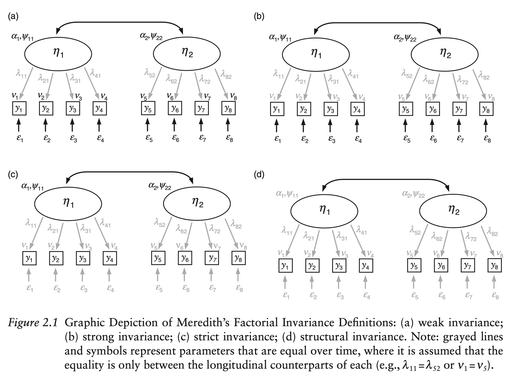

```{r setup, include=FALSE}
knitr::opts_chunk$set(echo = TRUE)

# Output width.
options(width = 100)

# Reduce code chunk and output size.
# See: https://stackoverflow.com/a/46526740/5252007.
def.chunk.hook  <- knitr::knit_hooks$get("chunk")
knitr::knit_hooks$set(chunk = function(x, options) {
    x <- def.chunk.hook(x, options)
    ifelse(options$size != "normalsize", paste0("\n \\", options$size, "\n\n", x, "\n\n \\normalsize"), x)
})

# Set the path only for interactive sessions.
if (interactive()) setwd("./Practical 07 - Measurement Invariance")

# Load the data for exercise two.
data_ex_2 <- read.table("./data/socex1.dat")

# Load libraries.
library(lavaan)
library(semPlot)
library(mvtnorm)
library(GGally)
```

---

# Lab Description

During this practical you will learn how to test for various types of
measurement invariance when dealing with both cross-sectional (i.e., *Exercise
1*) and longitudinal data (i.e., *Exercise 2*).

For this practical you will need the following packages:

- `lavaan` for structural equation modeling
- `semPlot` for visualizing structural equation models
- `mvtnorm` for generating multivariate normal data
- `GGally` for visualizing multivariate normal data

You can install and load these packages using the following code:

```{r size="footnotesize", eval=FALSE}
# Install packages.
install.packages(c("lavaan", "semPlot", "mvtnorm", "GGally"))

# Load the packages.
library(lavaan)
library(semPlot)
library(mvtnorm)
library(GGally)
```

## Exercise 1

This exercise consists of two parts. In the first part, we prepare the data
(i.e., in the form of means and covariances). In the second part, you are asked
to perform the measurement invariance tests discussed during the lecture. Note
that instead of using the entire data for our measurement invariance
investigation, we will instead use mean vectors and covariance matrices (i.e.,
see the *Multiple groups* section from the `lavaan` tutorial).

### Part 1. Preparing the data.

In Table 4.3 of @beaujeanLatentVariableModeling2014 [p. 66] (i.e., depicted in
*Figure 1*) we are presented with the means and covariances for a set of eight
random variables. Each random variables is assumed to be normally distributed
and represents an item on the [Wechsler Intelligence Scale for Children-Third
Edition](https://en.wikipedia.org/wiki/Wechsler_Intelligence_Scale_for_Children).

{width=100%}

Together, these items are assumed to measure two latent construct, namely the
Verbal-Comprehension (VC) and Visual-Spatial (VS) components of intelligence, as
depicted in the model in *Figure 2.*

{width=80%}

In our case, we have two groups, (1) one containing youth with manic symptoms
(i.e., $N = 81$), and (2) one representing the norming sample (i.e., $N = 200$).
To keep things short and readable, we will use the following abbreviations for
the variable names:

- `inf` = Information
- `sim` = Similarities
- `voc` = Vocabulary
- `com` = Comprehension
- `p_com` = Picture Completion
- `p_arr` = Picture Arrangement
- `b_des` = Block Design
- `o_ass` = Object Assembly

We start by storing the variable names, means, and covariances.

```{r size='scriptsize'}
# Variable names.
var_names <- c("inf", "sim", "voc", "com", "p_com", "p_arr", "b_des", "o_ass")

# Means and covariances for group with manic symptoms (i.e., group 1).
# Means for group 1.
group_1_means <- c(10.09, 12.07, 10.25, 9.96, 10.90, 11.24, 10.30, 10.44)

# Lower triangle of the covariance matrix for group 1.
group_1_cov_lower <- c(
    9.364, 7.777, 12.461, 6.422, 8.756, 10.112, 5.669,
    7.445, 6.797, 8.123, 3.048, 4.922, 4.513, 4.116,
    6.200, 3.505, 4.880, 4.899, 5.178, 5.114, 15.603,
    3.690, 5.440, 5.220, 3.151, 3.587, 6.219, 11.223,
    3.640, 4.641, 4.877, 3.568, 3.819, 5.811, 6.501, 9.797
)

# Create the entire covariance matrix for group 1.
group_1_cov <- lav_matrix_lower2full(group_1_cov_lower)

# Means and covariances for norming group (i.e., group 2).
# Means for group 2.
group_2_means <- c(10.10, 10.30, 9.80, 10.10, 10.10, 10.10, 9.90, 10.20)

# Lower triangle of the covariance matrix for group 2.
group_2_cov_lower <- c(
    9.610, 5.844, 8.410, 6.324, 6.264, 9.000, 4.405,
    4.457, 5.046, 8.410, 4.464, 4.547, 4.512, 3.712,
    10.240, 3.478, 2.967, 2.970, 2.871, 3.802, 10.890,
    5.270, 4.930, 4.080, 3.254, 5.222, 3.590, 11.560,
    4.297, 4.594, 4.356, 3.158, 4.963, 3.594, 6.620, 10.890
)

# Create the entire covariance matrix for group 2.
group_2_cov <- lav_matrix_lower2full(group_2_cov_lower)

# Add the variable names to the means and covariances for both groups.
# Add the names for the means.
names(group_1_means) <- var_names
names(group_2_means) <- var_names

# Add the names for the covariances.
rownames(group_1_cov) <- colnames(group_1_cov) <- var_names
rownames(group_2_cov) <- colnames(group_2_cov) <- var_names
```

We can print the the means and covariances for both groups as follows:

```{r size='scriptsize'}
# Means for group 1.
print(group_1_means)

# Means for group 2.
print(group_2_means)

# Covariances for group 1.
print(group_1_cov)

# Covariances for group 2.
print(group_2_cov)
```

Finally, as we can see in the documentation of `lavaan` for arguments
`sample.cov`, `sample.mean`, and `sample.nobs`, for multiple group analysis we
need to specify a list of mean vectors and covariance matrices:

> `sample.cov`: For a multiple group analysis, a list with a variance-covariance
> matrix for each group.

> `sample.mean`: For a multiple group analysis, a list with a mean vector for
> each group.

> `sample.nobs`: For a multiple group analysis, a list or a vector with the
> number of observations for each group.

We can create the required lists as follows:

```{r size='scriptsize'}
# Combine the mean vectors into a single list.
means <- list(
    group_1 = group_1_means,
    group_2 = group_2_means
)

# Combine the covariance matrices into a single list.
covariances <- list(
    group_1 = group_1_cov,
    group_2 = group_2_cov
)

# Combine the sample sizes into a single list.
samples <- list(
    group_1 = 81,
    group_1 = 200
)
```

Specify which fit measures we are interested in:

```{r size='scriptsize'}
# Fit indices to print.
fit_indices <- c("chisq", "df", "pvalue", "cfi", "tli", "rmsea", "rmsea.pvalue", "srmr")
```

### Part 2. Measurement invariance investigation.

a. Write down the model syntax for the model in *Figure 2.*

```{r size='scriptsize'}
# Model syntax.
model_ex_1 <- "
    # Measurement part.
    verbal =~ inf + sim + voc + com
    visual =~ p_com + p_arr + b_des + o_ass

    # Latent covariance.
    verbal ~~ visual
"
```

b. Manually fit the model in *Figure 2* for each group and allow the means of
   the observed variables to enter the model. Report and interpret the model
   fit.

To allow the observed means to enter the model, we need to set
`meanstructure = TRUE`, in the `lavaan` function `sem` or `cfa`. First, we fit
the model for the first group.

```{r size='scriptsize'}
# Fit the model for group 1.
model_ex_1_group_1_fit <- sem(
    model_ex_1,
    sample.cov = group_1_cov,
    sample.nobs = 81,
    sample.mean = group_1_means,
    meanstructure = TRUE
)

# Model summary.
summary(model_ex_1_group_1_fit, standardized = TRUE)

# Fit measures.
fitMeasures(model_ex_1_group_1_fit, fit.measures = fit_indices)
```

Then, we fit the model for the second group.

```{r size='scriptsize'}
# Fit the model for group 1.
model_ex_1_group_2_fit <- sem(
    model_ex_1,
    sample.cov = group_2_cov,
    sample.nobs = 200,
    sample.mean = group_2_means,
    meanstructure = TRUE
)

# Model summary.
summary(model_ex_1_group_2_fit, standardized = TRUE)

# Fit measures.
fitMeasures(model_ex_1_group_2_fit, fit.measures = fit_indices)
```

c. Investigate *configural* measurement invariance. Report and interpret the
   model fit.

We already investigated configural measurement invariance at point *(b)* by
manually fitting the model in each group and checking the global fit and whether
the loadings are significant for both groups. This time, instead of manually
fitting the model to each group, we will pass the list of mean vectors,
covariance matrices, and sample sizes to `lavaan`, which will automate the
fitting for us.

```{r size='scriptsize'}
# Fit the model to both groups.
model_ex_1_configural_fit <- sem(
    model_ex_1,
    sample.cov = covariances,
    sample.nobs = samples,
    sample.mean = means
)

# Model summary.
summary(model_ex_1_configural_fit, standardized = TRUE)

# Fit measures.
fitMeasures(model_ex_1_configural_fit, fit.measures = fit_indices)
```

We see that the model has an adequate fit for each group. Before we continue, we
can also plot the model for each group.

```{r size="footnotesize", dev="pdf", fig.width=20, fig.height=9, out.width="450px", fig.align="center"}
# Save the model plots for each groups as a list with two elements.
plots_configural <- semPaths(
    model_ex_1_configural_fit,
    what = "paths",
    whatLabels = "est",
    DoNotPlot = TRUE,
    ask = FALSE,
    title = FALSE
)

# Plot the model for the first group.
plot(plots_configural[[1]])
title("Configural MI | Group 1", adj = 0)

# Plot the model for the second group.
plot(plots_configural[[2]])
title("Configural MI | Group 2", adj = 0)
```

d. Investigate *weak* or *metric* measurement invariance. Report and interpret
   the model fit.

To investigate metric measurement invariance, we need to constrain the loadings
to be equal in both groups. To achieve this, we can use the `group.equal`
argument in `lavaan`.

```{r size="footnotesize", dev="pdf", fig.width=20, fig.height=9, out.width="450px", fig.align="center"}
# Fit the model.
model_ex_1_weak_fit <- sem(
    model_ex_1,
    sample.cov = covariances,
    sample.nobs = samples,
    sample.mean = means,
    group.equal = c("loadings")
)

# Model summary.
summary(model_ex_1_weak_fit, standardized = TRUE)

# Fit measures.
fitMeasures(model_ex_1_weak_fit, fit.measures = fit_indices)

# Save the model plots for each groups as a list with two elements.
plots_weak <- semPaths(
    model_ex_1_weak_fit,
    what = "paths",
    whatLabels = "est",
    DoNotPlot = TRUE,
    ask = FALSE,
    title = FALSE
)

# Plot the model for the first group.
plot(plots_weak[[1]])
title("Weak MI | Group 1", adj = 0)

# Plot the model for the second group.
plot(plots_weak[[2]])
title("Weak MI | Group 2", adj = 0)
```

e. Check if the the model fit at point *(d)* does not significantly worsen the
   fit compared to the model fit at point *(c)*.

Since these models are nested, can use the `anova()` function in `R` to perform
a LRT.

```{r size='scriptsize'}
# Perform LRT.
anova(model_ex_1_weak_fit, model_ex_1_configural_fit)
```

Our findings show support for weak measurement invariance. We see a $\chi^2$
difference value of $12.613$ with a $p\text{-value} = 0.049$. As discussed
during the lecture, the $\chi^2$ difference test is often significant for the
tiniest differences. A recommended practice is to also look at the decrease in
*CFI* and increase in *RMSEA* when moving to a higher level of measurement
invariance. For two groups, the decrease in *CFI* and increase in *RMSEA* should
not exceed $0.01$, which we see is the case.

f. Investigate *strong* or *scalar* measurement invariance. Report and interpret
   the model fit.

To investigate scalar measurement invariance, on top of constraining the
loadings to be equal in both groups, we also need to constrain the intercepts.
To achieve this, we can, again, use the `group.equal` argument in `lavaan`.

```{r size="footnotesize", dev="pdf", fig.width=20, fig.height=9, out.width="450px", fig.align="center"}
# Fit the model.
model_ex_1_strong_fit <- sem(
    model_ex_1,
    sample.cov = covariances,
    sample.nobs = samples,
    sample.mean = means,
    group.equal = c("loadings", "intercepts")
)

# Model summary.
summary(model_ex_1_strong_fit, standardized = TRUE)

# Fit measures.
fitMeasures(model_ex_1_strong_fit, fit.measures = fit_indices)

# Save the model plots for each groups as a list with two elements.
plots_strong <- semPaths(
    model_ex_1_strong_fit,
    what = "paths",
    whatLabels = "est",
    DoNotPlot = TRUE,
    ask = FALSE,
    title = FALSE
)

# Plot the model for the first group.
plot(plots_strong[[1]])
title("Strong MI | Group 1", adj = 0)

# Plot the model for the second group.
plot(plots_strong[[2]])
title("Strong MI | Group 2", adj = 0)
```

g. Check if the the model fit at point *(f)* does not significantly worsen the
   fit compared to the model fit at point *(d)*.

Since these models are nested, can use the `anova()` function in `R` to perform
a LRT.

```{r size='scriptsize'}
# Perform LRT.
anova(model_ex_1_strong_fit, model_ex_1_weak_fit)
```

Our findings do not show support for strong measurement invariance. We obtain a
$\chi^2$ difference value of $43.096$ with a $p\text{-value} < 0.001$. Also, the
rules of thumbs regarding the decrease in *CFI* and increase in *RMSEA* show
that we do not have support for strong measurement invariance.

h. Based on the findings above, should you continue with investigating strict
   measurement invariance or not?

Perform again the LRT for all nested models investigated so far.

```{r size='scriptsize'}
# LRT.
anova(model_ex_1_configural_fit, model_ex_1_weak_fit, model_ex_1_strong_fit)
```

We already see that we do not have support for strong measurement invariance.
Hence, we should not continue with strict measurement invariance. However, we
can identify which intercepts show misfit and allow those intercepts to be
freely estimated in both groups. Doing so, we investigate partial strong
measurement invariance.

i. Investigate which intercepts show misfit in the model fit at point *(f)*.
   Free the corresponding intercept to be freely estimated in both groups and
   compare the fit of this model with that fitted at point *(d)*.
    - Tip: check `lavaan` functions `parTable` and `lavTestScore`.

We check the misfit by looking at the discrepancy between the estimated
intercepts by `lavaan` and the observed means for each group. Then, we can test
if our fit would improve with those parameters being freely estimated.

To inspect the estimated intercepts, we use the `lavInspect` function in
`lavaan`.

```{r size='scriptsize'}
# Means discrepancies for group one.
lavInspect(model_ex_1_strong_fit, "mu")[[1]] - group_1_means

# Means discrepancies for group two.
lavInspect(model_ex_1_strong_fit, "mu")[[2]] - group_1_means
```

We can see that the misfit is most prominent for variable `sim`. We can now
check the improvement in model fit if we freely estimate the intercepts for
`sim` across groups (i.e., if we release them from the equality constraint). To
do this, we use the `lavTestScore` function in `lavaan`. First, let us use the
`parTable` function in `lavaan` to print the parameter table and learn the label
`lavaan` automatically generated for the intercept of variable `sim`. Note that,
behind the scenes, `lavaan` applies labels automatically to enforce the equality
constraints requested via the argument `group.equal`.

```{r size='scriptsize'}
# Show the parameter table.
parTable(model_ex_1_strong_fit)
```

We see that for the first group, `lavaan` attached the label `.p21.` for the
parameter `sim ~ 1` (i.e., the intercept).

```{r size='scriptsize'}
parTable(model_ex_1_strong_fit)[21, ]
```

In the second group, `lavaan` refers to the parameter `sim ~ 1` (i.e., the
intercept) using the label `.p50.`.

```{r size='scriptsize'}
parTable(model_ex_1_strong_fit)[50, ]
```

In order for `lavaan` to respect the equality constraints we requested, it set
both of these labels to be equal, i.e., `.p21. == .p50.`. Therefore, when
looking at the output of `lavTestScore` to understand which \enquote{release}
results in the highest change in the $\chi^2$ difference, we expect `.p21. ==
.p50.` to yield the highest change.

```{r size='scriptsize'}
# Perform the score test for releasing constrained model parameters.
lavTestScore(model_ex_1_strong_fit)
```

The overall `total score test` is a multivariate test indicating whether
releasing (i.e., freeing) all constraints improves the fit over the base model.
We reject the null hypothesis and proceed by looking at the univariate tests.
Here, we indeed see that freeing the constraint `.p21. == .p50.` would result in
the largest $\chi^2$ difference (e.g., $29.459$). We go ahead and refit the
strong measurement invariance model with the `sim ~ 1` freely estimated in both
groups. Then, we check again using the function `lavTestScore` whether
additional constraints can be freed. To do so, we use the `group.partial`
argument. In this case, we are are actually investigating is called *strong
partial measurement invariance*.

```{r size='scriptsize'}
# Fit the model.
model_ex_1_strong_partial_fit <- sem(
    model_ex_1,
    sample.cov = covariances,
    sample.nobs = samples,
    sample.mean = means,
    group.equal = c("loadings", "intercepts"),
    group.partial = c("sim ~ 1")
)

# Fit measures.
fitMeasures(model_ex_1_strong_partial_fit, fit.measures = fit_indices)

# Perform the score test.
lavTestScore(model_ex_1_strong_partial_fit)
```

This time we see that the multivariate score test is not significant and looking
at the univariate tests we cannot free any parameters. We perform again the
*LRT* for the nested models investigated so far.

```{r size='scriptsize'}
# LRT.
anova(model_ex_1_configural_fit, model_ex_1_weak_fit, model_ex_1_strong_partial_fit)
```

Based on the $\chi^2$ difference test above and the fit measures below we see
some support for partial scalar measurement invariance.

```{r size='scriptsize'}
# Combine all fit measures for all models into a data frame.
fit_measures_all_ex_1 <- rbind(
    configural = fitMeasures(model_ex_1_configural_fit, fit_indices),
    weak = fitMeasures(model_ex_1_weak_fit, fit_indices),
    strong = fitMeasures(model_ex_1_strong_fit, fit_indices),
    strong_partial = fitMeasures(model_ex_1_strong_partial_fit, fit_indices)
)

# Print the fit measures for all models with four decimals.
print(round(fit_measures_all_ex_1, 4))
```

j. What kind of comparisons can we make when we find support for strong
  (partial) measurement invariance?

When we find support for strong measurement invariance, we can compare the means
of the latent variables across groups. For our example, we see that children in
the second group (i.e., the norming group) perform worse than children in the
first group (i.e., with manic symptoms) on both the verbal (i.e., $-0.171$) and
visual (i.e., $-0.53$) components of intelligence. However, if we look at the
$p\text{-values}$ we see that neither of these differences are significant
(e.g., $p = 0.633$ for verbal and $p = 0.078$ for visual).

Additional information on the $p\text{-values}$:

```{r size='scriptsize'}
# Get the parameters.
par <- parameterTable(model_ex_1_strong_partial_fit)

# Filter the parameters for ease of read.
# Group ome should be reference, hence zero.
par[par$op == "~1" & par$group == 1 & (par$lhs == "verbal" | par$lhs == "visual"), ]

# Group two should show be relative to group one.
par[par$op == "~1" & par$group == 2 & (par$lhs == "verbal" | par$lhs == "visual"), ]

#    id    lhs op rhs user block group free ustart exo label plabel start    est    se
# 57 57 verbal ~1        0     2     2   51     NA   0        .p57.     0 -0.171 0.358
# 58 58 visual ~1        0     2     2   52     NA   0        .p58.     0 -0.530 0.301

# Or, we know that the intercepts are named `alpha` in SEM, hence we can look for
# that in the output of `inspect()`.
inspect(model_ex_1_strong_partial_fit, what = "est")

# $group_2$alpha
#        intrcp
# verbal -0.171
# visual -0.530

# Or, if you want the standard errors, replace `what = "est"` with `what = "se`.
inspect(model_ex_1_strong_partial_fit, what = "se")

# $group_2$alpha
#        intrcp
# verbal  0.358
# visual  0.301

# You can find the standard errors p-values in the summary output under the `Intercepts` section.
summary(model_ex_1_strong_partial_fit)

# Intercepts:
#                    Estimate  Std.Err  z-value  P(>|z|)
#       .                 .        .        .        .
#       .                 .        .        .        .
#       .                 .        .        .        .
#     verbal           -0.171    0.358   -0.477    0.633
#     visual           -0.530    0.301   -1.761    0.078

# Or, you can approximate the p-values yourself given that you have the standard errors.
# For `verbal` latent variable.
pnorm(-0.171 / 0.358) * 2
# [1] 0.6328968

# For `visual` latent variable.
pnorm(-0.530 / 0.301) * 2
# [1] 0.07827271
```

k. Investigate *strict* measurement invariance. Also, perform a *LRT* to compare
   the strict measurement invariance model to the strong partial measurement
   invariance model. Report and interpret model fit of the fitted model and the
   results of the *LRT*.

To investigate strict measurement invariance, on top of constraining the
loadings and the intercepts to be equal in both groups, we also need to
constrain the residual covariances. To achieve this, we can, again, use the
`group.equal` argument in `lavaan`.

```{r size="footnotesize", dev="pdf", fig.width=20, fig.height=9, out.width="450px", fig.align="center"}
# Fit the model.
model_ex_1_strict_fit <- sem(
    model_ex_1,
    sample.cov = covariances,
    sample.nobs = samples,
    sample.mean = means,
    group.equal = c("loadings", "intercepts", "residuals"),
    group.partial = c("sim ~ 1")
)

# Model summary.
summary(model_ex_1_strict_fit, standardized = TRUE)

# Fit measures.
fitMeasures(model_ex_1_strict_fit, fit.measures = fit_indices)

# Save the model plots for each groups as a list with two elements.
plots_strict <- semPaths(
    model_ex_1_strict_fit,
    what = "paths",
    whatLabels = "est",
    DoNotPlot = TRUE,
    ask = FALSE,
    title = FALSE
)

# Plot the model for the first group.
plot(plots_strict[[1]])
title("Strict MI | Group 1", adj = 0)

# Plot the model for the second group.
plot(plots_strict[[2]])
title("Strict MI | Group 2", adj = 0)
```

We can again combine the fit measures for the models investigated so far for
convenience.

```{r size='scriptsize'}
# Combine all fit measures.
fit_measures_all_ex_1 <- rbind(
    fit_measures_all_ex_1,
    strict = fitMeasures(model_ex_1_strict_fit, fit_indices)
)

# Print the fit measures for all models with four decimals.
print(round(fit_measures_all_ex_1, 4))
```

We observe a $\chi^2 = 129.978$ with $DF = 57$ and a $p\text{-value} = 0.001$.
The fit indices indicate some support for strict measurement invariance.

Finally, we perform a *LRT* between the strict model and the partial strong
model.

```{r size='scriptsize'}
# Perform LRT.
anova(
    model_ex_1_configural_fit,
    model_ex_1_weak_fit,
    model_ex_1_strong_partial_fit,
    model_ex_1_strict_fit
)
```

Based on the $\chi^2$ difference test and the fit measures above, we do not see
support for strict measurement invariance. We could, of course, use the same
strategy as above (i.e., using the function `lavTestScore`) to detect which
parameters to free in order to increase the model fit, but this exercise is
already getting too long...

l. What kinds of comparisons does strict measurement invariance allow you to
   make?

Strict measurement invariance is an important prerequisite if we want to make
comparisons based on the raw scores of variables (e.g., sum scores of
variables). The rationale behind this is that an observed score $X$ consists of
a true score $T$ and and error score $E$ (i.e., $X = T + E$; [see this in the
context of
reliability](https://maconstantin.shinyapps.io/reliability-measurement-error/)).
Therefore, with strict measurement invariance we insure that the error part
(i.e., $E$) is the same across groups, allowing us to validly compare sum scores
or other measures derived based the raw variable realizations.

### Part 3. Generating some data.

***Optional.***

In *Part 2* of this exercise we used the mean and covariance vectors and
matrices for multiple group *CFA*. In `lavaan`, we can also use the entire data
for multiple group *CFA*, in which case we can specify the `group` argument to
tell `lavaan` which variable to use to split our dataset. This implies that we
have an additional variable in our data which indicates the group membership
(e.g., manic vs. norming). In this part you will first learn how to generate a
complete dataset using reported means and covariances, then you will see how the
generated data can be used to test for configural measurement invariance. The
reminder of the measurement invariance checks (i.e., weak, strong and strict
measurement invariance) are left for you to do as an exercise. Note that this
part is optional and you can safely skip it. It is presented here as an example
for those of you who are curious about generating data.

To generate our complete datasets, we will use the means and covariances
presented in *Figure 1.* Since we already have the observed means and
covariances, and we assume that our data comes from a multivariate normal
distribution, we can \enquote{draw} a sample from this distribution using the
observed means and covariances. Recall that, just like the normal distribution,
the multivariate normal distribution depends on two parameters, the $\vec{\mu}$
vector of means and the $\mat{\Sigma}$ variance-covariance matrix:

$$
p(x; \vec{\mu}, \mat{\Sigma}) = \frac{1}{(2 \pi)^{n / 2}|\mat{\Sigma}|^{1 / 2}} \exp \left(-\frac{1}{2}(x - \vec{\mu})^{T} \mat{\Sigma}^{-1}(x - \vec{\mu})\right)
$$

Conceptually, this means that we use our observed means and covariances as
population parameters and we draw a sample from that population (e.g., imagine
applying a questionnaire). If the sample we drew is sufficiently large, then the
means and covariances we calculate on the generated data should be close to our
observed means and covariances that we used as population parameters.
Furthermore, since each group has its own values for the mean vector $\vec{\mu}$
and covariance matrix $\mat{\Sigma}$, we consider that each group comes for its
own population. Therefore, we draw two samples from the multivariate normal
distribution, one per group.

That being said, we can go ahead and generate some data. First, let us check
that we can indeed recover the means and covariances provided in *Figure 1* if
our sample is sufficiently large. We do this as an example for the first group.
As always, make sure to check the documentation for function `?rmvnorm` in the
`R` package `mvtnorm`.

```{r size='scriptsize'}
# Inspect the means for group one.
group_1_means

# Inspect the covariances for group one.
group_1_cov

# Draw a sample of one million respondents for group one.
data_ex_1_group_1 <- rmvnorm(n = 1e6, mean = group_1_means, sigma = group_1_cov)

# Check that we indeed have one million respondents for eight variables.
dim(data_ex_1_group_1)

# Compare the means of the variables in the generated data with the provided means.
round(group_1_means - colMeans(data_ex_1_group_1), 4)

# Compare the covariances of the generated data with the provided covariance matrix.
round(group_1_cov - cov(data_ex_1_group_1), 3)
```

We can see that the differences are quite small. You can test that the more we
increase the sample size (i.e., `n`), the smaller the differences become.

Now, let us go ahead and take more reasonably sized samples for both groups and
combine them into a single data frame. We will take a sample of $N = 100$ for
group one and $N = 300$ for group two. Since we are dealing with random number
generation (e.g., see `?RNG`), we also set a \enquote{seed} so we can replicate
the results.

```{r size='scriptsize'}
# Set seed for the `RNG`.
set.seed(20031993)

# Data for group one with 100 cases.
data_ex_1_group_1 <- rmvnorm(n = 100, mean = group_1_means, sigma = group_1_cov)

# Data for group two with 300 cases.
data_ex_1_group_2 <- rmvnorm(n = 300, mean = group_2_means, sigma = group_2_cov)
```

Before combining the data, we may also want to visualize what we generated. We
use the function `ggpairs` in package `GGally`. Note that the function expects
the data to be provided as a data frame and not matrix object.

```{r size="footnotesize", dev="pdf", fig.width=10, fig.height=10, out.width="450px", fig.align="center"}
# Generated data for group one.
ggpairs(as.data.frame(data_ex_1_group_1))

# Generated data for group two.
ggpairs(as.data.frame(data_ex_1_group_2))
```

We continue with combining the data for both groups into a single data frame.

```{r size='scriptsize'}
# Combine the two datasets into a single dataset.
data_ex_1 <- data.frame(rbind(data_ex_1_group_1, data_ex_1_group_2))

# Create a variable that holds the group membership.
group <- as.factor(c(rep("manic", 100), rep("norming", 300)))

# Inspect the `group` variable.
str(group)

# Now we can add the `group` variable to the dataset.
data_ex_1 <- cbind(data_ex_1, group = group)

# Inspect the head of the data.
head(data_ex_1)

# Inspect the tail of the data.
tail(data_ex_1)
```

With the data in hand, we can now perform the test for configural measurement
invariance. This time we use the full data and make use of the `group` argument
in `lavaan`. Note that the model syntax remains the same.

```{r size="footnotesize", dev="pdf", fig.width=20, fig.height=9, out.width="450px", fig.align="center"}
# Fit the model using the full data.
model_ex_1_configural_data_fit <- sem(model_ex_1, data_ex_1, group = "group")

# Model summary.
summary(model_ex_1_configural_data_fit, standardized = TRUE)

# Fit measures.
fitMeasures(model_ex_1_configural_data_fit, fit.measures = fit_indices)

# Save the model plots for each groups as a list with two elements.
plots_configural_data <- semPaths(
    model_ex_1_configural_data_fit,
    what = "paths",
    whatLabels = "est",
    DoNotPlot = TRUE,
    ask = FALSE,
    title = FALSE
)

# Plot the model for the first group.
plot(plots_configural_data[[1]])
title("Configural MI (data) | Group 1", adj = 0)

# Plot the model for the second group.
plot(plots_configural_data[[2]])
title("Configural MI (data) | Group 2", adj = 0)
```

\newpage

## Exercise 2

### Part 1. Investigating longitudinal measurement invariance.

In this part of *Exercise 2*, you are going to investigate measurement
invariance using longitudinal data. This exercise differs a bit from the
lecture, in the sense that we will not deploy measurement invariance tests to
check whether we can validly compare models parameters across groups. *Instead,
we test for measurement invariance to understand whether we can validly compare
model parameters across time*. In other words, we are interested to understand
whether our construct is measurement invariant from one measurement occasion to
the other.

Since testing for measurement invariance for longitudinal data is slightly more
involved than what we did during *Exercise 1*, I recommend you to take a look at
*Chapter 2* from @newsomLongitudinalStructuralEquation2015 (i.e., attached on
Canvas under the *References* heading for the current practical). For a
quick overview of the parametrization required, you can take a look at *Figure
3.* The relationships depicted in *Figure 3* are also described below:

- **Weak measurement invariance**: when loadings are equal over time but
  intercepts, unique variances, latent means, and latent variances vary over
  time.
- **Strong measurement invariance**: when loadings and intercepts do not vary
  but unique variances, latent means, and latent variances vary over time.
- **Strict measurement invariance**: when loadings, intercepts, and measurement
  residuals are equal over time.
- **Structural invariance**: when factor means, factor variances, loadings,
  intercepts, and measurement residuals are equal over time.

{width=100%}

Key points to keep in mind for this exercise:

- During *Exercise 1* we applied the constraints across groups (e.g., a
  loading in group one was constrained to be equal with the corresponding
  loading in group two).
- However, when we check for measurement invariance for longitudinal data, we
  think of the measurement occasions as our \enquote{groups}. In this case, we
    1. fit the latent construct at both measurement occasions in the same model,
    2. and constrain the parameters to be equal across time points (e.g., a
       loading for the latent construct at time point one constrained to be
       equal to the corresponding loading for the latent construct at time point
       two).
- So, the same ideas that you discussed during the lecture apply, but instead of
  fitting one model per group, you now fit a single model (i.e., with a latent
  construct per time point), and you constrain the parameters to be equal across
  time points.

The data you will use consists of a set of three items (i.e., `w1vst1`,
`w1vst2`, `w1vst3`, `w2vst1`, `w2vst2`, and `w2vst3`) measured at two time
points (i.e., `w1` for wave one and `w2` for wave two), with a total sample size
of $N = 574$. You can find the data in the folder for this practical on Canvas,
and the baseline model that you will investigate is graphically represented in
*Figure 4*.

{width=80%}

\newpage

Start this exercise by loading the dataset `socex1.dat` in `R` and adding the
following variable names to the data.

Set the working directory to the location where your data file has been
downloaded and load the data.

```{r size="footnotesize", eval=FALSE}
# For example.
setwd("/Users/mihai/Downloads")

# Load data.
data_ex_2 <- read.csv("socex1.dat")

# Inspect the data.
View(data_ex_2)
```

Set the variable names.

```{r size="footnotesize"}
# Variable names.
variable_ex_2_names <- c(
    "w1vst1", "w1vst2", "w1vst3", "w2vst1", "w2vst2",
    "w2vst3", "w3vst1", "w3vst2", "w3vst3", "w1unw1", "w1unw2", "w1unw3",
    "w2unw1", "w2unw2", "w2unw3", "w3unw1", "w3unw2", "w3unw3", "w1dboth",
    "w1dsad", "w1dblues", "w1ddep", "w2dboth", "w2dsad", "w2dblues", "w2ddep",
    "w3dboth", "w3dsad", "w3dblues", "w3ddep", "w1marr2", "w1happy", "w1enjoy",
    "w1satis", "w1joyful", "w1please", "w2happy", "w2enjoy", "w2satis", "w2joyful",
    "w2please", "w3happy", "w3enjoy", "w3satis", "w3joyful", "w3please", "w1lea",
    "w2lea", "w3lea"
)

# Set the names.
names(data_ex_2) <- variable_ex_2_names

# List variables.
str(data_ex_2)
```

Specify which fit measures we are interested in:

```{r size='scriptsize'}
# Fit indices to print.
fit_indices <- c("chisq", "df", "pvalue", "cfi", "tli", "rmsea", "rmsea.pvalue", "srmr")
```

a. Investigate *configural* measurement invariance and also estimate the means
   of the latent variables. Report and interpret the model fit.

Contrary to *Exercise 1*, we now have to set the constraints manually. Few
things to note:

- we use the default marker variable approach for setting the scales of latent
  variables `w1comp` and `w2comp`
- since we are going to estimate the means of the latent variables we must fix
  the first intercept at each time point to $0$ for model identification

```{r size="footnotesize", dev="pdf", fig.width=20, fig.height=9, out.width="450px", fig.align="center"}
# Model syntax.
model_ex_2_configural <- "
    # Measurement part.
    w1comp =~ w1vst1 + w1vst2 + w1vst3
    w2comp =~ w2vst1 + w2vst2 + w2vst3

    # Covariance between latent variables.
    w2comp ~~ w1comp

    # Covariances between residuals across time.
    w1vst1 ~~ w2vst1
    w1vst2 ~~ w2vst2
    w1vst3 ~~ w2vst3

    # Fix first intercept at each time point to 0 for identification.
    w1vst1 ~ 0
    w2vst1 ~ 0

    # Freely estimate means of latent variables.
    w1comp ~ 1
    w2comp ~ 1
"

# Fit the model.
model_ex_2_configural_fit <- sem(model_ex_2_configural, data_ex_2)

# Visualize the model.
semPaths(model_ex_2_configural_fit, what = "paths", whatLabels = "est")

# Add a title to the plot.
title("Longitudinal Configural MI", adj = 0)

# Model summary.
summary(model_ex_2_configural_fit, standardized = TRUE)

# Fit measures.
fitMeasures(model_ex_2_configural_fit, fit.measures = fit_indices)
```

The configural measurement invariance model fits the data well and all loadings
are significant. The other fit indices (e.g., *RMSEA* and *CFI*) also show
indicate good fit. The estimated means of the latent variables are $1.960$ for
`w1comp` and $2.031$ for `w2comp`. Note that we cannot yet compare these means.

b. Investigate *weak* or *metric* measurement invariance. Test if the additional
   constraints of the weak invariance model do not significantly worsen model
   fit in comparison to the configural model. Report and interpret the results.

For the metric measurement invariance, we need to constrain the loadings to be
equal across time points. To do this, we can use labels. Note that the marker
items do not need equality constraint, as those loadings are already set to $1$
for identification purposes. Just as for point *(a)*, we leave the mean
structure unconstrained.

```{r size="footnotesize", dev="pdf", fig.width=20, fig.height=9, out.width="450px", fig.align="center"}
# Model syntax.
model_ex_2_weak <- "
    # Measurement part.
    w1comp =~ w1vst1 + a * w1vst2 + b * w1vst3
    w2comp =~ w2vst1 + a * w2vst2 + b * w2vst3

    # Covariance between latent variables.
    w2comp ~~ w1comp

    # Covariances between residuals across time.
    w1vst1 ~~ w2vst1
    w1vst2 ~~ w2vst2
    w1vst3 ~~ w2vst3

    # Fix first intercept at each time point to 0 for identification.
    w1vst1 ~ 0
    w2vst1 ~ 0

    # Freely estimate means of latent variables.
    w1comp ~ 1
    w2comp ~ 1
"

# Fit the model.
model_ex_2_weak_fit <- sem(model_ex_2_weak, data_ex_2)

# Visualize the model.
semPaths(model_ex_2_weak_fit, what = "paths", whatLabels = "est")

# Add a title to the plot.
title("Longitudinal Weak MI", adj = 0)

# Model summary.
summary(model_ex_2_weak_fit, standardized = TRUE)

# Fit measures.
fitMeasures(model_ex_2_weak_fit, fit.measures = fit_indices)
```

Perform a LRT between the week model and the configural model.

```{r size="footnotesize"}
# Perform LRT.
anova(model_ex_2_weak_fit, model_ex_2_configural_fit)

# Combine the fit measures for the configural and weak model.
fit_measures_all_ex_2 <- rbind(
    configural = fitMeasures(model_ex_2_configural_fit, fit_indices),
    weak = fitMeasures(model_ex_2_weak_fit, fit_indices)
)

# Print fit measures with four decimals.
print(round(fit_measures_all_ex_2, 4))
```

The results indicate good model fit with a $\chi^2 = 12.076$ with $7$ degrees of
freedom and a $p\text{-value} = 0.098$. The change in *CFI* between the weak
model and the configural model is $0$, and *RMSEA* has dropped from $0.0414$ to
$.0355$, in accordance with rules of thumb. The $\chi^2$ difference test between
the two models (i.e., weak and configural) is also non-significant with
$p\text{-value} = 0.338$, indicating that the constrained model does not
significantly worsen the fit. Based on these results, we can conclude that we
have support for weak longitudinal measurement invariance and continue testing
for the next level of measurement invariance.

c. Investigate *strong* or *scalar* measurement invariance, now with the
   necessary equality constraints on the intercepts. Test if the additional
   constraints of the strong invariance model do not significantly worsen model
   fit in comparison to the weak invariance model. Report and interpret the
   results.

For the scalar measurement invariance we need the constrain the intercepts to be
equal across time. Since we are interested in the means of the latent variables,
we must fix the intercept for the first indicator at each time point to $0$ for
identification purposes. Therefore, we can only constrain the remaining
intercepts to be equal across time.

```{r size="footnotesize", dev="pdf", fig.width=20, fig.height=9, out.width="450px", fig.align="center"}
# Model syntax.
model_ex_2_strong <- "
    # Measurement part.
    w1comp =~ w1vst1 + a * w1vst2 + b * w1vst3
    w2comp =~ w2vst1 + a * w2vst2 + b * w2vst3

    # Covariance between latent variables.
    w2comp ~~ w1comp

    # Covariances between residuals across time.
    w1vst1 ~~ w2vst1
    w1vst2 ~~ w2vst2
    w1vst3 ~~ w2vst3

    # Fix first intercept at each time point to 0 for identification.
    w1vst1 ~ 0
    w2vst1 ~ 0

    # Constrain the remaining intercepts to be equal across time.
    w1vst2 ~ c * 1
    w1vst3 ~ d * 1
    w2vst2 ~ c * 1
    w2vst3 ~ d * 1

    # Freely estimate means of latent variables.
    w1comp ~ 1
    w2comp ~ 1
"

# Fit the model.
model_ex_2_strong_fit <- sem(model_ex_2_strong, data_ex_2)

# Visualize the model.
semPaths(model_ex_2_strong_fit, what = "paths", whatLabels = "est")

# Add a title to the plot.
title("Longitudinal Strong MI", adj = 0)

# Model summary.
summary(model_ex_2_strong_fit, standardized = TRUE)

# Fit measures.
fitMeasures(model_ex_2_strong_fit, fit.measures = fit_indices)
```

Perform a LRT between the strong model and the weak model.

```{r size="footnotesize"}
# Perform LRT.
anova(model_ex_2_strong_fit, model_ex_2_weak_fit)

# Combine the fit measures for the configural and weak model.
fit_measures_all_ex_2 <- rbind(
    fit_measures_all_ex_2,
    strong = fitMeasures(model_ex_2_strong_fit, fit_indices)
)

# Print fit measures with four decimals.
print(round(fit_measures_all_ex_2, 4))
```

The results indicate good model fit with a $\chi^2 = 12.399$ with $9$ degrees of
freedom and a $p\text{-value} = 0.192$. The change in *CFI* between the strong
model and the weak model is $0.001$, and *RMSEA* has dropped from $0.0355$ to
$0.0257$, in accordance with rules of thumb. The $\chi^2$ difference test
between the two models (i.e., strong and weak) is also non-significant with
$p\text{-value} = 0.851$, indicating that the constrained model does not
significantly worsen the fit. Based on these results, we can conclude that we
have support for strong longitudinal measurement invariance and continue testing
for the next level of measurement invariance.

Since we now have support for strong measurement invariance, we can validly
compare the means of the latent variables. We can, for example, test the
hypothesis that the latent variable means are equal across time. To do this, we
re-estimate the strong (i.e., scalar) measurement invariance model, with the
additional constrain that the latent variable means should be equal over time.

```{r size="footnotesize", dev="pdf", fig.width=20, fig.height=9, out.width="450px", fig.align="center"}
# Model syntax.
model_ex_2_strong_equal_latent_means <- "
    # Measurement part.
    w1comp =~ w1vst1 + a * w1vst2 + b * w1vst3
    w2comp =~ w2vst1 + a * w2vst2 + b * w2vst3

    # Covariance between latent variables.
    w2comp ~~ w1comp

    # Covariances between residuals across time.
    w1vst1 ~~ w2vst1
    w1vst2 ~~ w2vst2
    w1vst3 ~~ w2vst3

    # Fix first intercept at each time point to 0 for identification.
    w1vst1 ~ 0
    w2vst1 ~ 0

    # Constrain the remaining intercepts to be equal across time.
    w1vst2 ~ c * 1
    w1vst3 ~ d * 1
    w2vst2 ~ c * 1
    w2vst3 ~ d * 1

    # Freely estimate means of latent variables.
    w1comp ~ h * 1
    w2comp ~ h * 1
"

# Fit the model.
model_ex_2_strong_equal_latent_means_fit <- sem(model_ex_2_strong_equal_latent_means, data_ex_2)

# Visualize the model.
semPaths(model_ex_2_strong_equal_latent_means_fit, what = "paths", whatLabels = "est")

# Add a title to the plot.
title("Long. Strong MI (equal latent means)", adj = 0)

# Model summary.
summary(model_ex_2_strong_equal_latent_means_fit, standardized = TRUE)

# Fit measures.
fitMeasures(model_ex_2_strong_equal_latent_means_fit, fit.measures = fit_indices)

# Combine the fit measures for the configural and weak model.
fit_measures_all_ex_2 <- rbind(
    fit_measures_all_ex_2,
    strong_equal_latent_means = fitMeasures(model_ex_2_strong_equal_latent_means_fit, fit_indices)
)

# Print fit measures with four decimals.
print(round(fit_measures_all_ex_2, 4))
```

The estimate for the mean of the latent variable at both time points is $2.004$.
We see that our additional constraint on the latent means does not significantly
worsen the model fit. Hence, we can say that we have support for the hypothesis
of no change in the latent means across time.

d. Investigate *strict* measurement invariance. Test if the additional
   constraints of the strict invariance model do not significantly worsen model
   fit in comparison to the strong invariance model. Report and interpret the
   results.

For the strict level of measurement invariance, we must do everything we did for
the strong model and, on top of that, also constrain the the measurement
residuals to be equal across time.

```{r size="footnotesize", dev="pdf", fig.width=20, fig.height=9, out.width="450px", fig.align="center"}
# Model syntax.
model_ex_2_strict <- "
    # Measurement part.
    w1comp =~ w1vst1 + a * w1vst2 + b * w1vst3
    w2comp =~ w2vst1 + a * w2vst2 + b * w2vst3

    # Covariance between latent variables.
    w2comp ~~ w1comp

    # Covariances between residuals across time.
    w1vst1 ~~ w2vst1
    w1vst2 ~~ w2vst2
    w1vst3 ~~ w2vst3

    # Fix first intercept at each time point to 0 for identification.
    w1vst1 ~ 0
    w2vst1 ~ 0

    # Constrain the remaining intercepts to be equal across time.
    w1vst2 ~ c * 1
    w1vst3 ~ d * 1
    w2vst2 ~ c * 1
    w2vst3 ~ d * 1

    # Freely estimate means of latent variables.
    w1comp ~ 1
    w2comp ~ 1

    # Set measurement residuals to be equal across time.
    w1vst1 ~~ e * w1vst1
    w1vst2 ~~ f * w1vst2
    w1vst3 ~~ g * w1vst3
    w2vst1 ~~ e * w2vst1
    w2vst2 ~~ f * w2vst2
    w2vst3 ~~ g * w2vst3
"

# Fit the model.
model_ex_2_strict_fit <- sem(model_ex_2_strict, data_ex_2)

# Visualize the model.
semPaths(model_ex_2_strict_fit, what = "paths", whatLabels = "est")

# Add a title to the plot.
title("Longitudinal Strict MI", adj = 0)

# Model summary.
summary(model_ex_2_strict_fit, standardized = TRUE)

# Fit measures.
fitMeasures(model_ex_2_strict_fit, fit.measures = fit_indices)
```

Perform a LRT between the strict model and the strong model.

```{r size="footnotesize"}
# Perform LRT.
anova(model_ex_2_strict_fit, model_ex_2_strong_fit)

# Combine the fit measures for the configural and weak model.
fit_measures_all_ex_2 <- rbind(
    fit_measures_all_ex_2,
    strict = fitMeasures(model_ex_2_strict_fit, fit_indices)
)

# Print fit measures with four decimals.
print(round(fit_measures_all_ex_2, 4))
```

These results indicate that strict measurement invariance is not supported
(i.e., the $\chi^2$ is significant and the *CFI* and *RMSEA* worsen in
comparison with the strong measurement invariance model).

e. Consider this statement: \enquote{The factor mean invariance test is really a
   test of the equality of the observed means for the marker variables at each
   time point.} Is this statement true or false. Explain your answer.

Because factor means are a function of measurement intercepts, tests of factor
means are not independent of intercept tests. With the marker variable approach
(i.e., where we give the latent variable basically the scale of the marker
variable), the mean of the factor is equal to the expected value of the
indicator variable.

### Part 2. A naïve approach?

We have seen that the `R` package `lavaan` has full support for multiple group
analysis (i.e., as demonstrated in the `lavaan` tutorial and seen in *Exercise
1*). Consider how the data in the dataset `socex1.dat` are currently structured.
Would it be possible to re-estimate the models investigated during *Exercise 2*
with the multiple group analysis module? Justify your answer.

The data are in wide format. However, even if we transfer the data to long
format and add a grouping variable to indicate the measurement occasions, we
cannot use the automated procedure for multiple group analysis in `lavaan`. The
reason for this is because we have longitudinal data and it makes sense to allow
for the error terms to covary across time. Since the automated procedure in
`lavaan` fits the model to each group separately (i.e., time point in our case),
there is no way to estimate a covariance between the error terms of two separate
models.

<!-- New page. -->
\newpage

# References
