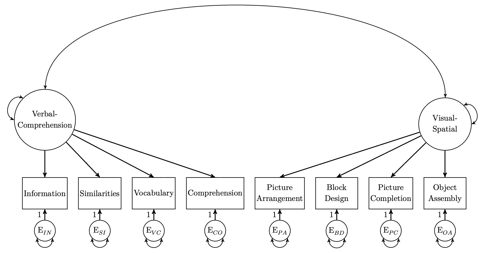

```{r setup, include=FALSE}
knitr::opts_chunk$set(echo = TRUE)

# Output width.
options(width = 100)

# Reduce code chunk and output size.
# See: https://stackoverflow.com/a/46526740/5252007.
def.chunk.hook  <- knitr::knit_hooks$get("chunk")
knitr::knit_hooks$set(chunk = function(x, options) {
    x <- def.chunk.hook(x, options)
    ifelse(options$size != "normalsize", paste0("\n \\", options$size, "\n\n", x, "\n\n \\normalsize"), x)
})

# Set the path only for interactive sessions.
if (interactive()) setwd("./Practical 07 - Measurement Invariance")

# Load the data for exercise two.
data_ex_2 <- read.table("./data/socex1.dat")

# Load libraries.
library(lavaan)
library(semPlot)
library(mvtnorm)
library(GGally)
```

---

# Lab Description

During this practical you will learn how to test for various types of
measurement invariance when dealing with both cross-sectional (i.e., *Exercise
1*) and longitudinal data (i.e., *Exercise 2*).

For this practical you will need the following packages:

- `lavaan` for structural equation modeling
- `semPlot` for visualizing structural equation models
- `mvtnorm` for generating multivariate normal data
- `GGally` for visualizing multivariate normal data

You can install and load these packages using the following code:

```{r size="footnotesize", eval=FALSE}
# Install packages.
install.packages(c("lavaan", "semPlot", "mvtnorm", "GGally"))

# Load the packages.
library(lavaan)
library(semPlot)
library(mvtnorm)
library(GGally)
```

## Exercise 1

This exercise consists of two parts. In the first part, we prepare the data
(i.e., in the form of means and covariances). In the second part, you are asked
to perform the measurement invariance tests discussed during the lecture. Note
that instead of using the entire data for our measurement invariance
investigation, we will instead use mean vectors and covariance matrices (i.e.,
see the *Multiple groups* section from the `lavaan` tutorial).

### Part 1. Preparing the data.

In Table 4.3 of @beaujeanLatentVariableModeling2014 [p. 66] (i.e., depicted in
*Figure 1*) we are presented with the means and covariances for a set of eight
random variables. Each random variables is assumed to be normally distributed
and represents an item on the [Wechsler Intelligence Scale for Children-Third
Edition](https://en.wikipedia.org/wiki/Wechsler_Intelligence_Scale_for_Children).

{width=100%}

Together, these items are assumed to measure two latent construct, namely the
Verbal-Comprehension (VC) and Visual-Spatial (VS) components of intelligence, as
depicted in the model in *Figure 2.*

{width=80%}

In our case, we have two groups, (1) one containing youth with manic symptoms
(i.e., $N = 81$), and (2) one representing the norming sample (i.e., $N = 200$).
To keep things short and readable, we will use the following abbreviations for
the variable names:

- `inf` = Information
- `sim` = Similarities
- `voc` = Vocabulary
- `com` = Comprehension
- `p_com` = Picture Completion
- `p_arr` = Picture Arrangement
- `b_des` = Block Design
- `o_ass` = Object Assembly

We start by storing the variable names, means, and covariances.

```{r size='scriptsize'}
# Variable names.
var_names <- c("inf", "sim", "voc", "com", "p_com", "p_arr", "b_des", "o_ass")

# Means and covariances for group with manic symptoms (i.e., group 1).
# Means for group 1.
group_1_means <- c(10.09, 12.07, 10.25, 9.96, 10.90, 11.24, 10.30, 10.44)

# Lower triangle of the covariance matrix for group 1.
group_1_cov_lower <- c(
    9.364, 7.777, 12.461, 6.422, 8.756, 10.112, 5.669,
    7.445, 6.797, 8.123, 3.048, 4.922, 4.513, 4.116,
    6.200, 3.505, 4.880, 4.899, 5.178, 5.114, 15.603,
    3.690, 5.440, 5.220, 3.151, 3.587, 6.219, 11.223,
    3.640, 4.641, 4.877, 3.568, 3.819, 5.811, 6.501, 9.797
)

# Create the entire covariance matrix for group 1.
group_1_cov <- lav_matrix_lower2full(group_1_cov_lower)

# Means and covariances for norming group (i.e., group 2).
# Means for group 2.
group_2_means <- c(10.10, 10.30, 9.80, 10.10, 10.10, 10.10, 9.90, 10.20)

# Lower triangle of the covariance matrix for group 2.
group_2_cov_lower <- c(
    9.610, 5.844, 8.410, 6.324, 6.264, 9.000, 4.405,
    4.457, 5.046, 8.410, 4.464, 4.547, 4.512, 3.712,
    10.240, 3.478, 2.967, 2.970, 2.871, 3.802, 10.890,
    5.270, 4.930, 4.080, 3.254, 5.222, 3.590, 11.560,
    4.297, 4.594, 4.356, 3.158, 4.963, 3.594, 6.620, 10.890
)

# Create the entire covariance matrix for group 2.
group_2_cov <- lav_matrix_lower2full(group_2_cov_lower)

# Add the variable names to the means and covariances for both groups.
# Add the names for the means.
names(group_1_means) <- var_names
names(group_2_means) <- var_names

# Add the names for the covariances.
rownames(group_1_cov) <- colnames(group_1_cov) <- var_names
rownames(group_2_cov) <- colnames(group_2_cov) <- var_names
```

We can print the the means and covariances for both groups as follows:

```{r size='scriptsize'}
# Means for group 1.
print(group_1_means)

# Means for group 2.
print(group_2_means)

# Covariances for group 1.
print(group_1_cov)

# Covariances for group 2.
print(group_2_cov)
```

Finally, as we can see in the documentation of `lavaan` for arguments
`sample.cov`, `sample.mean`, and `sample.nobs`, for multiple group analysis we
need to specify a list of mean vectors and covariance matrices:

> `sample.cov`: For a multiple group analysis, a list with a variance-covariance
> matrix for each group.

> `sample.mean`: For a multiple group analysis, a list with a mean vector for
> each group.

> `sample.nobs`: For a multiple group analysis, a list or a vector with the
> number of observations for each group.

We can create the required lists as follows:

```{r size='scriptsize'}
# Combine the mean vectors into a single list.
means <- list(
    group_1 = group_1_means,
    group_2 = group_2_means
)

# Combine the covariance matrices into a single list.
covariances <- list(
    group_1 = group_1_cov,
    group_2 = group_2_cov
)

# Combine the sample sizes into a single list.
samples <- list(
    group_1 = 81,
    group_2 = 200
)
```

Specify which fit measures we are interested in:

```{r size='scriptsize'}
# Fit indices to print.
fit_indices <- c("chisq", "df", "pvalue", "cfi", "tli", "rmsea", "rmsea.pvalue", "srmr")
```

### Part 2. Measurement invariance investigation.

a. Write down the model syntax for the model in *Figure 2.*

b. Manually fit the model in *Figure 2* for each group and allow the means of
   the observed variables to enter the model. Report and interpret the model
   fit.

c. Investigate *configural* measurement invariance. Report and interpret the
   model fit.

d. Investigate *weak* or *metric* measurement invariance. Report and interpret
   the model fit.

e. Check if the the model fit at point *(d)* does not significantly worsen the
   fit compared to the model fit at point *(c)*.

f. Investigate *strong* or *scalar* measurement invariance. Report and interpret
   the model fit.

g. Check if the the model fit at point *(f)* does not significantly worsen the
   fit compared to the model fit at point *(d)*.

h. Based on the findings above, should you continue with investigating strict
   measurement invariance or not?

i. Investigate which intercepts show misfit in the model fit at point *(f)*.
   Free the corresponding intercept to be freely estimated in both groups and
   compare the fit of this model with that fitted at point *(d)*.
    - Tip: check `lavaan` functions `parTable` and `lavTestScore`.

j. What kind of comparisons can we make when we find support for strong
  (partial) measurement invariance?

k. Investigate *strict* measurement invariance. Also, perform a *LRT* to compare
   the strict measurement invariance model to the strong partial measurement
   invariance model. Report and interpret model fit of the fitted model and the
   results of the *LRT*.

l. What kinds of comparisons does strict measurement invariance allow you to
   make?

### Part 3. Generating some data.

***This part is only for the brave.***

In *Part 2* of this exercise we used the mean and covariance vectors and
matrices for multiple group *CFA*. In `lavaan`, we can also use the entire data
for multiple group *CFA*, in which case we can specify the `group` argument to
tell `lavaan` which variable to use to split our dataset. This implies that we
have an additional variable in our data which indicates the group membership
(e.g., manic vs. norming). In this part you will first learn how to generate a
complete dataset using reported means and covariances, then you will see how the
generated data can be used to test for configural measurement invariance. The
reminder of the measurement invariance checks (i.e., weak, strong and strict
measurement invariance) are left for you to do as an exercise. Note that this
part is optional and you can safely skip it. It is presented here as an example
for those of you who are curious about generating data.

To generate our complete datasets, we will use the means and covariances
presented in *Figure 1.* Since we already have the observed means and
covariances, and we assume that our data comes from a multivariate normal
distribution, we can \enquote{draw} a sample from this distribution using the
observed means and covariances. Recall that, just like the normal distribution,
the multivariate normal distribution depends on two parameters, the $\vec{\mu}$
vector of means and the $\mat{\Sigma}$ variance-covariance matrix:

$$
p(x; \vec{\mu}, \mat{\Sigma}) = \frac{1}{(2 \pi)^{n / 2}|\mat{\Sigma}|^{1 / 2}} \exp \left(-\frac{1}{2}(x - \vec{\mu})^{T} \mat{\Sigma}^{-1}(x - \vec{\mu})\right)
$$

Conceptually, this means that we use our observed means and covariances as
population parameters and we draw a sample from that population (e.g., imagine
applying a questionnaire). If the sample we drew is sufficiently large, then the
means and covariances we calculate on the generated data should be close to our
observed means and covariances that we used as population parameters.
Furthermore, since each group has its own values for the mean vector $\vec{\mu}$
and covariance matrix $\mat{\Sigma}$, we consider that each group comes for its
own population. Therefore, we draw two samples from the multivariate normal
distribution, one per group.

That being said, we can go ahead and generate some data. First, let us check
that we can indeed recover the means and covariances provided in *Figure 1* if
our sample is sufficiently large. We do this as an example for the first group.
As always, make sure to check the documentation for function `?rmvnorm` in the
`R` package `mvtnorm`.

```{r size='scriptsize'}
# Inspect the means for group one.
group_1_means

# Inspect the covariances for group one.
group_1_cov

# Draw a sample of one million respondents for group one.
data_ex_1_group_1 <- rmvnorm(n = 1e6, mean = group_1_means, sigma = group_1_cov)

# Check that we indeed have one million respondents for eight variables.
dim(data_ex_1_group_1)

# Compare the means of the variables in the generated data with the provided means.
round(group_1_means - colMeans(data_ex_1_group_1), 4)

# Compare the covariances of the generated data with the provided covariance matrix.
round(group_1_cov - cov(data_ex_1_group_1), 3)
```

We can see that the differences are quite small. You can test that the more we
increase the sample size (i.e., `n`), the smaller the differences become.

Now, let us go ahead and take more reasonably sized samples for both groups and
combine them into a single data frame. We will take a sample of $N = 100$ for
group one and $N = 300$ for group two. Since we are dealing with random number
generation (e.g., see `?RNG`), we also set a \enquote{seed} so we can replicate
the results.

```{r size='scriptsize'}
# Set seed for the `RNG`.
set.seed(20031993)

# Data for group one with 100 cases.
data_ex_1_group_1 <- rmvnorm(n = 100, mean = group_1_means, sigma = group_1_cov)

# Data for group two with 300 cases.
data_ex_1_group_2 <- rmvnorm(n = 300, mean = group_2_means, sigma = group_2_cov)
```

Before combining the data, we may also want to visualize what we generated. We
use the function `ggpairs` in package `GGally`. Note that the function expects
the data to be provided as a data frame and not matrix object.

```{r size="footnotesize", dev="pdf", fig.width=10, fig.height=10, out.width="450px", fig.align="center"}
# Generated data for group one.
ggpairs(as.data.frame(data_ex_1_group_1))

# Generated data for group two.
ggpairs(as.data.frame(data_ex_1_group_2))
```

We continue with combining the data for both groups into a single data frame.

```{r size='scriptsize'}
# Combine the two datasets into a single dataset.
data_ex_1 <- data.frame(rbind(data_ex_1_group_1, data_ex_1_group_2))

# Create a variable that holds the group membership.
group <- as.factor(c(rep("manic", 100), rep("norming", 300)))

# Inspect the `group` variable.
str(group)

# Now we can add the `group` variable to the dataset.
data_ex_1 <- cbind(data_ex_1, group = group)

# Inspect the head of the data.
head(data_ex_1)

# Inspect the tail of the data.
tail(data_ex_1)
```

With the data in hand, we can now perform the test for configural measurement
invariance. This time we use the full data and make use of the `group` argument
in `lavaan`. Note that the model syntax remains the same.

```{r size="footnotesize", dev="pdf", fig.width=20, fig.height=9, out.width="450px", fig.align="center"}
# Model syntax.
model_ex_1 <- "
    # Measurement part.
    verbal =~ inf + sim + voc + com
    visual =~ p_com + p_arr + b_des + o_ass

    # Latent covariance.
    verbal ~~ visual
"

# Fit the model using the full data.
model_ex_1_configural_data_fit <- sem(model_ex_1, data_ex_1, group = "group")

# Model summary.
summary(model_ex_1_configural_data_fit, standardized = TRUE)

# Fit measures.
fitMeasures(model_ex_1_configural_data_fit, fit.measures = fit_indices)

# Save the model plots for each groups as a list with two elements.
plots_configural_data <- semPaths(
    model_ex_1_configural_data_fit,
    what = "paths",
    whatLabels = "est",
    DoNotPlot = TRUE,
    ask = FALSE,
    title = FALSE
)

# Plot the model for the first group.
plot(plots_configural_data[[1]])
title("Configural MI (data) | Group 1", adj = 0)

# Plot the model for the second group.
plot(plots_configural_data[[2]])
title("Configural MI (data) | Group 2", adj = 0)
```

\newpage

## Exercise 2

### Part 1. Investigating longitudinal measurement invariance.

In this part of *Exercise 2*, you are going to investigate measurement
invariance using longitudinal data. This exercise differs a bit from the
lecture, in the sense that we will not deploy measurement invariance tests to
check whether we can validly compare models parameters across groups. *Instead,
we test for measurement invariance to understand whether we can validly compare
model parameters across time*. In other words, we are interested to understand
whether our construct is measurement invariant from one measurement occasion to
the other.

Since testing for measurement invariance for longitudinal data is slightly more
involved than what we did during *Exercise 1*, I recommend you to take a look at
*Chapter 2* from @newsomLongitudinalStructuralEquation2015 (i.e., attached on
Canvas under the *References* heading for the current practical). For a
quick overview of the parametrization required, you can take a look at *Figure
3.* The relationships depicted in *Figure 3* are also described below:

- **Weak measurement invariance**: when loadings are equal over time but
  intercepts, unique variances, latent means, and latent variances vary over
  time.
- **Strong measurement invariance**: when loadings and intercepts do not vary
  but unique variances, latent means, and latent variances vary over time.
- **Strict measurement invariance**: when loadings, intercepts, and measurement
  residuals are equal over time.
- **Structural invariance**: when factor means, factor variances, loadings,
  intercepts, and measurement residuals are equal over time.

{width=100%}

Key points to keep in mind for this exercise:

- During *Exercise 1* we applied the constraints across groups (e.g., a
  loading in group one was constrained to be equal with the corresponding
  loading in group two).
- However, when we check for measurement invariance for longitudinal data, we
  think of the measurement occasions as our \enquote{groups}. In this case, we
    1. fit the latent construct at both measurement occasions in the same model,
    2. and constrain the parameters to be equal across time points (e.g., a
       loading for the latent construct at time point one constrained to be
       equal to the corresponding loading for the latent construct at time point
       two).
- So, the same ideas that you discussed during the lecture apply, but instead of
  fitting one model per group, you now fit a single model (i.e., with a latent
  construct per time point), and you constrain the parameters to be equal across
  time points.

The data you will use consists of a set of three items (i.e., `w1vst1`,
`w1vst2`, `w1vst3`, `w2vst1`, `w2vst2`, and `w2vst3`) measured at two time
points (i.e., `w1` for wave one and `w2` for wave two), with a total sample size
of $N = 574$. You can find the data in the folder for this practical on Canvas,
and the baseline model that you will investigate is graphically represented in
*Figure 4*.

{width=80%}

\newpage

Start this exercise by loading the dataset `socex1.dat` in `R` and adding the
following variable names to the data.

Set the working directory to the location where your data file has been
downloaded and load the data.

```{r size="footnotesize", eval=FALSE}
# For example.
setwd("/Users/mihai/Downloads")

# Load data.
data_ex_2 <- read.csv("socex1.dat")

# Inspect the data.
View(data_ex_2)
```

Set the variable names.

```{r size="footnotesize"}
# Variable names.
variable_ex_2_names <- c(
    "w1vst1", "w1vst2", "w1vst3", "w2vst1", "w2vst2",
    "w2vst3", "w3vst1", "w3vst2", "w3vst3", "w1unw1", "w1unw2", "w1unw3",
    "w2unw1", "w2unw2", "w2unw3", "w3unw1", "w3unw2", "w3unw3", "w1dboth",
    "w1dsad", "w1dblues", "w1ddep", "w2dboth", "w2dsad", "w2dblues", "w2ddep",
    "w3dboth", "w3dsad", "w3dblues", "w3ddep", "w1marr2", "w1happy", "w1enjoy",
    "w1satis", "w1joyful", "w1please", "w2happy", "w2enjoy", "w2satis", "w2joyful",
    "w2please", "w3happy", "w3enjoy", "w3satis", "w3joyful", "w3please", "w1lea",
    "w2lea", "w3lea"
)

# Set the names.
names(data_ex_2) <- variable_ex_2_names

# List variables.
str(data_ex_2)
```

Specify which fit measures we are interested in:

```{r size='scriptsize'}
# Fit indices to print.
fit_indices <- c("chisq", "df", "pvalue", "cfi", "tli", "rmsea", "rmsea.pvalue", "srmr")
```

a. Investigate *configural* measurement invariance and also estimate the means
   of the latent variables. Report and interpret the model fit.

b. Investigate *weak* or *metric* measurement invariance. Test if the additional
   constraints of the weak invariance model do not significantly worsen model
   fit in comparison to the configural model. Report and interpret the results.

c. Investigate *strong* or *scalar* measurement invariance, now with the
   necessary equality constraints on the intercepts. Test if the additional
   constraints of the strong invariance model do not significantly worsen model
   fit in comparison to the weak invariance model. Report and interpret the
   results.

d. Investigate *strict* measurement invariance. Test if the additional
   constraints of the strict invariance model do not significantly worsen model
   fit in comparison to the strong invariance model. Report and interpret the
   results.

e. Consider this statement: \enquote{The factor mean invariance test is really a
   test of the equality of the observed means for the marker variables at each
   time point.} Is this statement true or false. Explain your answer.

### Part 2. A naïve approach?

We have seen that the `R` package `lavaan` has full support for multiple group
analysis (i.e., as demonstrated in the `lavaan` tutorial and seen in *Exercise
1*). Consider how the data in the dataset `socex1.dat` are currently structured.
Would it be possible to re-estimate the models investigated during *Exercise 2*
with the multiple group analysis module? Justify your answer.

<!-- New page. -->
\newpage

# References
