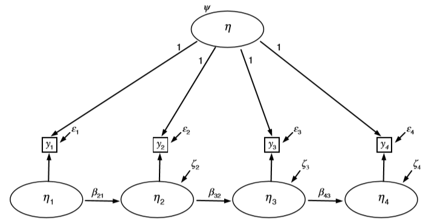

```{r setup, include=FALSE}
knitr::opts_chunk$set(echo = TRUE)

# Output width.
options(width = 100)

# Reduce code chunk and output size.
# See: https://stackoverflow.com/a/46526740/5252007.
def.chunk.hook  <- knitr::knit_hooks$get("chunk")
knitr::knit_hooks$set(chunk = function(x, options) {
    x <- def.chunk.hook(x, options)
    ifelse(options$size != "normalsize", paste0("\n \\", options$size, "\n\n", x, "\n\n \\normalsize"), x)
})

# Store the path.
path <- "/Users/mihai/OneDrive/School/Teaching/Structural Equation Modeling - ReMa - Tilburg/2021/Lecture 09 - Statistical Modeling of Panel Data/Practical"

# Set the path.
setwd(path)

# Load the data.
data_ex_1 <- read.table("./data/health.dat")
data_ex_2 <- read.table("./data/socex1.dat")
data_ex_3 <- read.table("./data/health.dat")

# Load libraries.
library(lavaan)
library(semPlot)
library(corrplot)
```

---

# Lab Description

For this practical you will need the following packages: `lavaan`, `semPlot`, and `corrplot`.
You can install and load these packages using the following code:

```{r size="footnotesize", eval=FALSE}
# Install packages.
install.packages(c("lavaan", "semPlot", "corrplot"))

# Load the packages.
library(lavaan)
library(semPlot)
library(corrplot)
```

Specify which fit measures we are interested in:

```{r size='scriptsize'}
# Fit indices to print.
fit_indices <- c("chisq", "df", "pvalue", "cfi", "tli", "rmsea", "rmsea.pvalue", "srmr")
```

## Quick Recap

Before we start, let's take a quick look at some of the models discussed during
the lecture. They may seem hard, but the two key ideas you should remember are:

1. all these models try to do is describe change across time, so try to identify
   the auto-regressive or cross-regressive effects
2. each model has its own way of decomposing the variance, e.g., trait vs. state
   vs. error variance

\newpage

**The Simplex Model**

- individuals change at a steady rate
- external influences are minimal
- $\hat{r}_{t, t - l} = r^{l}_{t, t - 1}$

{width=100%}

**The Quasi-Simplex Model**

- same as the **Simplex Model**, but it account for measurement error via the
  estimation of measurement residuals with single-indicator latent variables

{width=100%}

\newpage

**The Univariate STARTS Model**

Proposes that at each time point, the measured variable can be a function of
three independent latent variables:

- a *stable trait* (i.e., *ST*)
- a *time-varying factor* reflecting an auto-regressive trait (i.e., *ART*)
- a *state factor* reflecting time-specific effects and measurement error (i.e.,
  *S*)

The total variance at one time point is given by $var(ST) + var(ART) + var(S)$.

{width=100%}

\newpage

**The Multivariate STARTS Model**

Same as the **Univariate STARTS Model**, but now the construct is measured by
multiple indicators.

{width=100%}

\newpage

## Exercise 1

In this exercise you are going to investigate whether a repeated measurement
conforms to the *simplex* or *quasi-simplex* correlation structure. Consider the
dataset `health.dat`, which can be found in the folder for the current practical
on Canvas. These data are derived from a national health survey with interviews
of individuals aged $50$ years and above conducted biannually. You are going to
analyze the self-rated health question about overall health collected over six
waves. Ratings from this question were from $1$ (*poor*) to $5$ (*excellent*).
The repeated measurement variables are: `srh1`, `srh2`, `srh3`, `srh4`, `srh5`,
`srh6`. To get you started, you can use the following code to load the data and
set the variable names.

Set the working directory to the location where your data file has been
downloaded and load the data.

```{r size="footnotesize", eval=FALSE}
# For example.
setwd("/Users/mihai/Downloads")

# Load data.
data_ex_1 <- read.table("health.dat")

# Inspect the data.
View(data_ex_1)
```

Set the variable names.

```{r size="footnotesize"}
# Variable names.
variable_ex_1_names = c(
    "age", "srh1", "srh2", "srh3", "srh4", "srh5", "srh6", "bmi1",
    "bmi2", "bmi3", "bmi4", "bmi5", "bmi6", "cesdna1", "cesdpa1", "cesdso1",
    "cesdna2", "cesdpa2", "cesdso2", "cesdna3", "cesdpa3", "cesdso3",
    "cesdna4", "cesdpa4", "cesdso4", "cesdna5", "cesdpa5", "cesdso5",
    "cesdna6", "cesdpa6", "cesdso6", "diab1", "diab2", "diab3 ", "diab4", "diab5", "diab6"
)

# Set the names.
names(data_ex_1) <- variable_ex_1_names

# List variables.
str(data_ex_1)
```

a. Estimate the perfect simplex model for these six repeated measurement.
   Request a standardized solution, and evaluate the fit of this model.

```{r size="footnotesize", dev="pdf", fig.width=20, fig.height=9, out.width="450px", fig.align="center"}
# Model syntax.
model_ex_1_simplex <- "
    srh2 ~ srh1
    srh3 ~ srh2
    srh4 ~ srh3
    srh5 ~ srh4
    srh6 ~ srh5
"

# Fit model.
model_ex_1_simplex_fit <- sem(model_ex_1_simplex, data = data_ex_1)

# Visualize the model.
semPaths(model_ex_1_simplex_fit, what = "paths", whatLabels = "est")

# Model summary.
summary(model_ex_1_simplex_fit, standardized = TRUE)

# Fit measures.
fitMeasures(model_ex_1_simplex_fit, fit.measures = fit_indices)
```

We know that for a **simplex** model, the individuals are changing at a steady
rate and external influences affecting the rate of change are minimal. We see
that this is not the case with the model we just fit. The observed correlations
do not decease exponentially with additional lag lengths. The model has poor fit
to the data.

Note that you can also fit again the model in `model_ex_1_simplex`, but this time
add equality constraints for the auto-regressive paths. Then, compare the fit of
this *perfect* **simplex** model to `model_ex_1_simplex`. That way you can tell
more precisely whether your data does indeed conform to a perfect simplex
structure.

b. Inspect the correlation of the first time point measurement ($t_1$) with
   later time points, and the standardized auto-regression coefficients. Does
   the pattern of these coefficients provide evidence that the perfect simplex
   model holds?

```{r size="footnotesize", dev="pdf", fig.width=6, fig.height=6, out.width="250px", fig.align="center"}
# Subset data.
data_ex_1_subset <- data_ex_1[, c("srh1", "srh2", "srh3", "srh4", "srh5", "srh6")]

# Compute correlations.
ex_1_cors_simplex <- cor(data_ex_1_subset)

# Print the correlations.
round(ex_1_cors_simplex, 3)

# Visualize the correlations.
corrplot(ex_1_cors_simplex, method = "number", type = "lower")
```

Inspection of correlation of the $t_1$ with later time points (i.e., $r_{12} =
.619$, $r_{13} = .669$, $r_{14} = .626$, $r_{15} = .607$, $r_{16} = .585$) shows
that correlations decline at greater lag length, but not at an exponential rate.
Also, standardized auto-regression coefficients i.e., ($.691$, $.677$, $.683$,
$.707$, $.712$) show increasing values due to cumulative increases in stability
estimates.

c. Now estimate the quasi-simplex model. For identification purposes, set the
   measurement residual variances of the first and last measurement to $0$.
   Again, request a standardized solution and evaluate the fit of this model.

**Note.** The first and last residuals must be set to $0$ for identification.
Parameter estimates involving first and last variable do not take into account
measurement error.

```{r size="footnotesize", dev="pdf", fig.width=20, fig.height=9, out.width="450px", fig.align="center"}
# Model syntax.
model_ex_1_quasi_simplex <- "
    # Measurement part.
    eta1 =~ 1 * srh1
    eta2 =~ 1 * srh2
    eta3 =~ 1 * srh3
    eta4 =~ 1 * srh4
    eta5 =~ 1 * srh5
    eta6 =~ 1 * srh6

    # Set residuals to 0 for identification.
    srh1 ~~ 0 * srh1
    srh6 ~~ 0 * srh6

    # Freely estimate the remaining residuals.
    srh2 ~~ srh2
    srh3 ~~ srh3
    srh4 ~~ srh4
    srh5 ~~ srh5

    # Structural part.
    eta2 ~ eta1
    eta3 ~ eta2
    eta4 ~ eta3
    eta5 ~ eta4
    eta6 ~ eta5
"

# Fit model.
model_ex_1_quasi_simplex_fit <- sem(model_ex_1_quasi_simplex, data = data_ex_1)

# Visualize the model.
semPaths(model_ex_1_quasi_simplex_fit, what = "paths", whatLabels = "est")

# Model summary.
summary(model_ex_1_quasi_simplex_fit, standardized = TRUE)

# Fit measures.
fitMeasures(model_ex_1_quasi_simplex_fit, fit.measures = fit_indices)
```

We see that the fit of this model is better.

An alternative parametrization, more closely related to what was discussed
during the lecture, is to (1) constrain all residual variances to be equal across
time, and also (2) constrain the auto-regressive coefficients to be equal.

```{r size="footnotesize", dev="pdf", fig.width=20, fig.height=9, out.width="450px", fig.align="center"}
# Model syntax.
model_ex_1_quasi_simplex_alt <- "
    # Measurement part.
    eta1 =~ 1 * srh1
    eta2 =~ 1 * srh2
    eta3 =~ 1 * srh3
    eta4 =~ 1 * srh4
    eta5 =~ 1 * srh5
    eta6 =~ 1 * srh6

    # Freely estimate the remaining residuals.
    srh1 ~~ b * srh1
    srh2 ~~ b * srh2
    srh3 ~~ b * srh3
    srh4 ~~ b * srh4
    srh5 ~~ b * srh5
    srh6 ~~ b * srh6

    # Structural part.
    eta2 ~ a * eta1
    eta3 ~ a * eta2
    eta4 ~ a * eta3
    eta5 ~ a * eta4
    eta6 ~ a * eta5
"

# Fit model.
model_ex_1_quasi_simplex_alt_fit <- sem(model_ex_1_quasi_simplex_alt, data = data_ex_1)
```

And we can indeed see that the new model `model_ex_1_quasi_simplex_alt` has a
similar fit to `model_ex_1_quasi_simplex`.

```{r size="footnotesize"}
# Print the fit indices side-by-side.
round(cbind(
    model_ex_1_quasi_simplex = fitMeasures(model_ex_1_quasi_simplex_fit, fit.measures = fit_indices),
    model_ex_1_quasi_simplex_alt = fitMeasures(model_ex_1_quasi_simplex_alt_fit, fit.measures = fit_indices)
    ), 4
)
```

d. Perform a Likelihood Ratio Test (LRT) of the perfect simplex model against the
   quasi-simplex model. Interpret the result of this test.

Perform a LRT via the `anova` function in `R`.

```{r size="footnotesize"}
# LRT.
anova(model_ex_1_simplex_fit, model_ex_1_quasi_simplex_fit)
```

Also compare the fit indices

```{r size="footnotesize"}
# Store fit measures.
ex_1_fit_measures <- rbind(
    simplex = fitMeasures(model_ex_1_simplex_fit, fit.measures = fit_indices),
    quasi_simplex = fitMeasures(model_ex_1_quasi_simplex_fit, fit.measures = fit_indices)
)

# Print fit measures.
round(ex_1_fit_measures, 3)
```

The model with measurement error (i.e., the **quasi-simplex** model) fits
significantly better than **simplex** model.

e. Obtain the estimated correlations among the latent variables, using the
   `lavInspect()` function. Note that you can check the documentation for this
   function by running `?lavInspect` in `R`.

```{r size="footnotesize", dev="pdf", fig.width=6, fig.height=6, out.width="250px", fig.align="center"}
# Obtain correlations.
ex_1_cors_quasi_simplex <- lavInspect(model_ex_1_quasi_simplex_fit, "cor.lv")

# Print the correlations.
round(ex_1_cors_quasi_simplex, 3)

# Visualize the correlations.
corrplot(ex_1_cors_quasi_simplex, method = "number", type = "lower")
```

f. Inspect the correlation of the second time point ($t_2$) measurement with
   later time points, and the standardized auto-regression coefficients. Does
   the pattern of these coefficients provide evidence that the data conform to
   the simplex structure, if measurement error is taken into account for the
   measurement at $t_2$ to $t_5$?

The estimated correlations suggest conformity to simplex correlation structure.
For example, if we look at latent factor correlations between $t_2$ and $t_4$
(i.e., $r = .906$), and $t_2$ and $t_5$ (i.e., $r = .860$), these values are
close to what we would obtain if the latent correlation between $t_2$ and $t_3$
(i.e., $r = .955$) is raised to the second and third power, respectively: $.955
^ 2 = .912$, and $.955 ^ 3 = .871$. Also note that, once measurement error is
accounted for, we see little evidence of cumulative increase in stability
coefficients across the middle three auto-regression coefficients.

\newpage

## Exercise 2

Consider the *Cross-Lagged Panel Model* depicted in *Figure 5*.

{width=80%}

Using the `socex1.dat` data, estimate a similar model to investigate the
bidirectional effects between *positive affect* (PA) and *unwanted advice* (UA).
The specifications of the model are as follows:

- `w1posaff` (latent variable *PA* at $t_1$) with indicators: `w1happy`, `w1enjoy`, `w1satis`, `w1joyful`, and `w1please`
- `w2posaff` (latent variable *PA* at $t_2$) with indicators: `w2happy`, `w2enjoy`, `w2satis`, `w2joyful`, and `w2please`
- `w1unw` (latent variable *UA* at $t_1$) with indicators: `w1unw1`, `w1unw2`, and `w1unw3`
- `w2unw` (latent variable *UA* at $t_2$) with indicators: `w2unw1`, `w2unw2`, and `w2unw3`

In addition, in this model you should:

- Do not use the marker method to set the scale of the latent variables, but
  free the marker variables and set exogenous factor variance for first occasion
  latent variables for identification purpose to $1$.
- Impose equality constraints for the loadings between the different measurement
  moments for repeated indicators.
- Estimate the cross-lagged and auto-regressive effects.
- Include correlated measurement residuals.

To get you started, you can use the following `R` code to load the data and set
the variable names.

Load the data.

```{r size="footnotesize", eval=FALSE}
# Load data.
data_ex_2 <- read.table("socex1.dat")

# Inspect the data.
View(data_ex_2)
```

Create and set the variable names.

```{r size="footnotesize"}
# Variable names.
variable_ex_2_names <- c(
    "w1vst1", "w1vst2", "w1vst3", "w2vst1", "w2vst2",
    "w2vst3", "w3vst1", "w3vst2", "w3vst3", "w1unw1", "w1unw2", "w1unw3",
    "w2unw1", "w2unw2", "w2unw3", "w3unw1", "w3unw2", "w3unw3", "w1dboth",
    "w1dsad", "w1dblues", "w1ddep", "w2dboth", "w2dsad", "w2dblues", "w2ddep",
    "w3dboth", "w3dsad", "w3dblues", "w3ddep", "w1marr2", "w1happy", "w1enjoy",
    "w1satis", "w1joyful", "w1please", "w2happy", "w2enjoy", "w2satis", "w2joyful",
    "w2please", "w3happy", "w3enjoy", "w3satis", "w3joyful", "w3please", "w1lea",
    "w2lea", "w3lea"
)

# Set the names.
names(data_ex_2) <- variable_ex_2_names

# List variables.
str(data_ex_2)
```

Answer the following:

a. Estimate the parameters of the model in *Figure 5* (i.e., including
   standardized parameters) and evaluate the model fit.

Note that we will:

- use common labels for loadings to impose longitudinal equality constraints
- not use marker identification (i.e., the first loading is marker by default), hence
  `NA` removes the marker constraint

```{r size="footnotesize", dev="pdf", fig.width=20, fig.height=9, out.width="450px", fig.align="center"}
# Model syntax.
model_ex_2_clp <- "
    # Measurement part for first latent variable at both time points.
    w1posaff =~ NA * w1happy + l1 * w1happy + l2 * w1enjoy + l3 * w1satis + l4 * w1joyful + l5 * w1please
    w2posaff =~ NA * w2happy + l1 * w2happy + l2 * w2enjoy + l3 * w2satis + l4 * w2joyful + l5 * w2please

    # Measurement part for second latent variable at both time points.
    w1unw =~ NA * w1unw1  + l6 * w1unw1  + l7 * w1unw2 +  l8 * w1unw3
    w2unw =~ NA * w2unw1  + l6 * w2unw1  + l7 * w2unw2 +  l8 * w2unw3

    # Constrain exogenous factor variance at first occasion for identification.
    w1posaff ~~ 1 * w1posaff
    w1unw ~~ 1 * w1unw

    # Cross-lagged and auto-regressive effects.
    w2posaff ~ w1posaff + w1unw
    w2unw ~ w1unw + w1posaff

    # Correlated measurement residuals for first latent variable.
    w1happy ~~ w2happy
    w1enjoy ~~ w2enjoy
    w1satis ~~ w2satis
    w1joyful ~~ w2joyful
    w1please ~~ w2please

    # Correlated measurement residuals for second latent variable.
    w1unw1 ~~ w2unw1
    w1unw2 ~~ w2unw2
    w1unw3 ~~ w2unw3
"

# Fit model.
model_ex_2_clp_fit <- sem(model_ex_2_clp, data = data_ex_2)

# Visualize the model.
semPaths(model_ex_2_clp_fit, what = "paths", whatLabels = "est")

# Model summary.
summary(model_ex_2_clp_fit, standardized = TRUE)

# Fit measures.
fitMeasures(model_ex_2_clp_fit, fit.measures = fit_indices)
```

The model has reasonably good fit to the data.

b. What is the size of the auto-regressive and cross-lagged standardized effects
   in this model?

We can look at the summary output for our model fit, under the `Regressions`
heading.

```{r size="footnotesize", eval=FALSE}
# Regressions:
#                    Estimate  Std.Err  z-value  P(>|z|)   Std.lv  Std.all
#   w2posaff ~
#     w1posaff          0.600    0.050   11.899    0.000    0.565    0.565
#     w1unw            -0.020    0.049   -0.406    0.685   -0.019   -0.019
#   w2unw ~
#     w1unw             0.390    0.048    8.169    0.000    0.414    0.414
#     w1posaff         -0.172    0.048   -3.598    0.000   -0.182   -0.182
```

\newpage

## Exercise 3

Using the dataset `health.dat`:

a. Estimate for the six repeated measurements the trait-state-error model, as
proposed by Kenny & Zautra (1995). You can use as starting point the model
depicted in *Figure 6*, but note that it should be extended to include `y1` to
`y6`.

{width=80%}

Note. The latent *trait-state-error* model is equivalent to the univariate
*STARTS* model discussed during the lecture. In a nutshell, the *STARTS* model
consists of:

- stable trait (i.e., the "trait" in the *trait-state-error* terminology)
- auto-regressive trait (i.e., the "state" in the *trait-state-error* terminology)
- state (i.e., the "error" in the *trait-state-error* terminology), which, in
  the univariate *STARTS* model, also contains error as mentioned in the lecture

Load the data.

```{r size="footnotesize", eval=FALSE}
# For example.
setwd("/Users/mihai/Downloads")

# Load data.
data_ex_3 <- read.table("health.dat")

# Inspect the data.
View(data_ex_3)
```

Set the variable names (i.e., same names as we used for *Exercise 1*).

```{r size="footnotesize"}
# Set the names.
names(data_ex_3) <- variable_ex_1_names

# List variables.
str(data_ex_3)
```

To construct a single observed measurement per wave, calculate the average score
of the three indicators per wave, as follows:

```{r size="footnotesize"}
# Add the average scores per wave as follows.
data_ex_3$cesd1 = with(data_ex_3, (cesdna1 + cesdpa1 + cesdso1) / 3)
data_ex_3$cesd2 = with(data_ex_3, (cesdna2 + cesdpa2 + cesdso2) / 3)
data_ex_3$cesd3 = with(data_ex_3, (cesdna3 + cesdpa3 + cesdso3) / 3)
data_ex_3$cesd4 = with(data_ex_3, (cesdna4 + cesdpa4 + cesdso4) / 3)
data_ex_3$cesd5 = with(data_ex_3, (cesdna5 + cesdpa5 + cesdso5) / 3)
data_ex_3$cesd6 = with(data_ex_3, (cesdna6 + cesdpa6 + cesdso6) / 3)
```

The model follows that shown in *Figure 2* and, specifies a single trait factor
with the loading for each indicator set equal to $1$ and a latent state factor
with a single loading set equal to $1$ at each occasion. Each state factor is
regressed on the state factor from the prior time point. Several longitudinal
equality constraints should be imposed (i.e., stationarity):

- all auto-regressive coefficients are set equal
- all state factor residuals except for the first state factor are set equal
- all measurement residuals are set equal

The trait variance and the state factor variance at $t_1$ are free to be
estimated, and $\eta$ and $\eta_1$ are assumed independent.

```{r size="footnotesize", dev="pdf", fig.width=20, fig.height=9, out.width="450px", fig.align="center"}
# Model syntax.
model_ex_3_lts <- "
    # Trait factor.
    eta =~ 1 * cesd1 + 1 * cesd2 + 1 * cesd3 + 1 * cesd4 + 1 * cesd5 + 1 * cesd6

    # State factors.
    eta1 =~ cesd1
    eta2 =~ cesd2
    eta3 =~ cesd3
    eta4 =~ cesd4
    eta5 =~ cesd5
    eta6 =~ cesd6

    # Auto-regressive paths.
    eta2 ~ b * eta1
    eta3 ~ b * eta2
    eta4 ~ b * eta3
    eta5 ~ b * eta4
    eta6 ~ b * eta5

    # State factor residuals.
    # The variance of exogenous variable is model parameter.
    eta1 ~~ p2 * eta1
    eta2 ~~ p3 * eta2
    eta3 ~~ p3 * eta3
    eta4 ~~ p3 * eta4
    eta5 ~~ p3 * eta5
    eta6 ~~ p3 * eta6

    # Measurement residuals.
    cesd1 ~~ a * cesd1
    cesd2 ~~ a * cesd2
    cesd3 ~~ a * cesd3
    cesd4 ~~ a * cesd4
    cesd5 ~~ a * cesd5
    cesd6 ~~ a * cesd6

    # Exogenous covariances are set to zero.
    eta ~~ 0 * eta1
"

# Fit model.
model_ex_3_lts_fit <- sem(model_ex_3_lts, data = data_ex_3)

# Visualize the model.
semPaths(model_ex_3_lts_fit, what = "paths", whatLabels = "est")

# Model summary.
summary(model_ex_3_lts_fit, standardized = TRUE)

# Fit measures.
fitMeasures(model_ex_3_lts_fit, fit.measures = fit_indices)
```

b. What is the fit of this model?

The model seems to fit the data reasonably well.

c. Verify the calculations reported by Newsom for this model:
    - proportion of trait variance equal to $.43$
    - proportion of state variance equal to $.10$
    - proportion of error variance equal to $.47$


We extract and calculate the proportions of variance as follows:

```{r size="footnotesize"}
# First take a look at the coefficients.
coefficients <- coef(model_ex_3_lts_fit)

# Let's store the names so we can quickly search by name.
names <- names(coefficients)

# Store all variances
variance_trait <- as.numeric(coefficients["eta~~eta"])
variance_state <- mean(coefficients[grepl("^p[0-9]$", names)])
variance_error <- mean(coefficients[grepl("^a$", names)])

# Print the variances.
c(
    trait = variance_trait,
    state = variance_state,
    error = variance_error
)

# Proportion of trait variance.
variance_trait / sum(variance_trait, variance_state, variance_error)

# Proportion of state variance.
variance_state / sum(variance_trait, variance_state, variance_error)

# Proportion of error variance.
variance_error / sum(variance_trait, variance_state, variance_error)
```

This, indeed, matches what Newsom reported.
