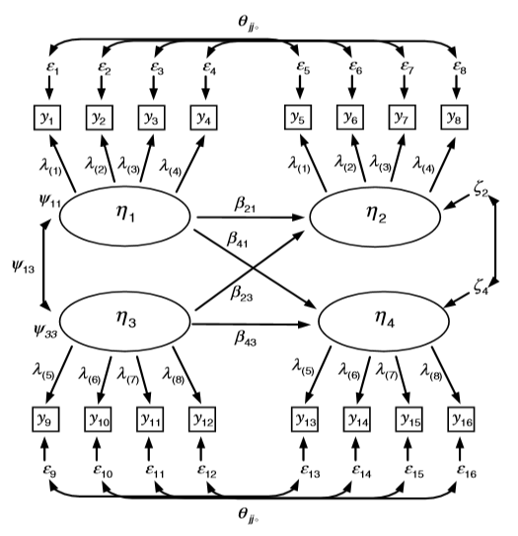
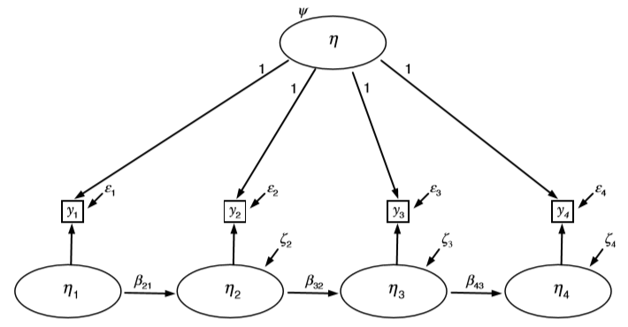

```{r setup, include=FALSE}
knitr::opts_chunk$set(echo = TRUE)

# Output width.
options(width = 100)

# Reduce code chunk and output size.
# See: https://stackoverflow.com/a/46526740/5252007.
def.chunk.hook  <- knitr::knit_hooks$get("chunk")
knitr::knit_hooks$set(chunk = function(x, options) {
    x <- def.chunk.hook(x, options)
    ifelse(options$size != "normalsize", paste0("\n \\", options$size, "\n\n", x, "\n\n \\normalsize"), x)
})

# Store the path.
path <- "/Users/mihai/OneDrive/School/Teaching/Structural Equation Modeling - ReMa - Tilburg/2021/Lecture 09 - Statistical Modeling of Panel Data/Practical"

# Set the path.
setwd(path)

# Load libraries.
library(lavaan)
library(semPlot)
```

---

# Lab Description

For this practical you will need the following packages: `lavaan` and `semPlot`.
You can install and load these packages using the following code:

```{r size="footnotesize", eval=FALSE}
# Install packages.
install.packages(c("lavaan", "semPlot"))

# Load the packages.
library(lavaan)
library(semPlot)
```

## Exercise 1

In this exercise you are going to investigate whether a repeated measurement
conforms to the *simplex* or *quasi-simplex* correlation structure. Consider the
dataset `health.dat`, which can be found in the folder for the current practical
on Canvas. These data are derived from a national health survey with interviews
of individuals aged $50$ years and above conducted biannually. You are going to
analyze the self-rated health question about overall health collected over six
waves. Ratings from this question were from $1$ (*poor*) to $5$ (*excellent*).
The repeated measurement variables are: `srh1`, `srh2`, `srh3`, `srh4`, `srh5`,
`srh6`. To get you started, you can use the following code to load the data and
set the variable names.

Set the working directory to the location where your data file has been
downloaded and load the data.

```{r size="footnotesize", eval=FALSE}
# For example.
setwd("/Users/mihai/Downloads")

# Load data.
data_ex_1 <- read.table("health.dat")

# Inspect the data.
View(data_ex_1)
```

Set the variable names.

```{r size="footnotesize", eval=FALSE}
# Variable names.
variable_ex_1_names = c(
    "age", "srh1", "srh2", "srh3", "srh4", "srh5", "srh6", "bmi1",
    "bmi2", "bmi3", "bmi4", "bmi5", "bmi6", "cesdna1", "cesdpa1", "cesdso1",
    "cesdna2", "cesdpa2", "cesdso2", "cesdna3", "cesdpa3", "cesdso3",
    "cesdna4", "cesdpa4", "cesdso4", "cesdna5", "cesdpa5", "cesdso5",
    "cesdna6", "cesdpa6", "cesdso6", "diab1", "diab2", "diab3 ", "diab4", "diab5", "diab6"
)

# Set the names.
names(data_ex_1) <- variable_ex_1_names

# List variables.
str(data_ex_1)
```

a. Estimate the perfect simplex model for these six repeated measurement.
   Request a standardized solution, and evaluate the fit of this model.

b. Inspect the correlation of the first time ($t_1$) point measurement with
   later time points, and the standardized auto-regression coefficients. Does
   the pattern of these coefficients provide evidence that the perfect simplex
   model holds?

c. Now estimate the quasi-simplex model. For identification purposes, set the
   measurement residual variances of the first and last measurement to $0$.
   Again, request a standardized solution and evaluate the fit of this model.

d. Perform a likelihood ratio test of the perfect simplex model against the
   quasi-simplex model. Interpret the result of this test.

e. Obtain the estimated correlations among the latent variables, using the
   `lavInspect()` function. Note that you can check the documentation for this
   function by running `?lavInspect` in `R`.

f. Inspect the correlation of the second time point ($t_2$) measurement with
   later time points, and the standardized auto-regression coefficients. Does
   the pattern of these coefficients provide evidence that the data conform to
   the simplex structure, if measurement error is taken into account for the
   measurement at $t_2$ to $t_5$?

\newpage

## Exercise 2

Consider the *Cross-Lagged Panel Model* depicted in *Figure 1*.

{width=80%}

Using the `socex1.dat` data, estimate a similar model to investigate the
bidirectional effects between *positive affect* (PA) and *unwanted advice* (UA).
The specifications of the model are as follows:

- `W1POSAFF` (latent variable *PA* at $t_1$) with indicators: `w1happy`, `w1enjoy`, `w1satis`, `w1joyful`, and `w1please`
- `W2POSAFF` (latent variable *PA* at $t_2$) with indicators: `w2happy`, `w2enjoy`, `w2satis`, `w2joyful`, and `w2please`
- `W1UNW` (latent variable *UA* at $t_1$) with indicators: `w1unw1`, `w1unw2`, and `w1unw3`
- `W2UNW` (latent variable *UA* at $t_2$) with indicators: `w2unw1`, `w2unw2`, and `w2unw3`

In addition, in this model you should:

- Do not use the marker method to set the scale of the latent variables, but
  free the marker variables and set exogenous factor variance for first occasion
  latent variables for identification purpose to $1$.
- Impose equality constraints for the loadings between the different measurement
  moments for repeated indicators.
- Estimate the cross-lagged and auto-regressive effects.
- Include correlated measurement residuals.

To get you started, you can use the following `R` code to load the data and set
the variable names.

```{r size="footnotesize", eval=FALSE}
# Load data.
data_ex_2 <- read.table("socex1.dat")

# Inspect the data.
View(data_ex_2)

# Variable names.
variable_ex_2_names <- c(
    "w1vst1", "w1vst2", "w1vst3", "w2vst1", "w2vst2",
    "w2vst3", "w3vst1", "w3vst2", "w3vst3", "w1unw1", "w1unw2", "w1unw3",
    "w2unw1", "w2unw2", "w2unw3", "w3unw1", "w3unw2", "w3unw3", "w1dboth",
    "w1dsad", "w1dblues", "w1ddep", "w2dboth", "w2dsad", "w2dblues", "w2ddep",
    "w3dboth", "w3dsad", "w3dblues", "w3ddep", "w1marr2", "w1happy", "w1enjoy",
    "w1satis", "w1joyful", "w1please", "w2happy", "w2enjoy", "w2satis", "w2joyful",
    "w2please", "w3happy", "w3enjoy", "w3satis", "w3joyful", "w3please", "w1lea",
    "w2lea", "w3lea"
)

# Set the names.
names(data_ex_2) <- variable_ex_2_names

# List variables.
str(data_ex_2)
```

Answer the following:

a. Estimate the parameters of this model (i.e., including standardized
   parameters) and evaluate the model fit.

b. What is the size of the auto-regressive and cross-lagged standardized effects
   in this model?

\newpage

## Exercise 3

Using the dataset `health.dat`:

a. Estimate for the six repeated measurements the trait-state-error model, as
proposed by Kenny & Zautra (1995). You can use as starting point the model
depicted in *Figure 2*, but note that it should be extended to include `y1` to
`y6`.

{width=80%}

To construct a single observed measurement per wave, calculate the average score
of the three indicators per wave, as follows:

```{r size="footnotesize", eval=FALSE}
# Assuming you data for this exercise is called `data_ex_3`, add the average
# scores per wave as follows.
data_ex_3$cesd1 = (cesdna1 + cesdpa1 + cesdso1) / 3
data_ex_3$cesd2 = (cesdna2 + cesdpa2 + cesdso2) / 3
data_ex_3$cesd3 = (cesdna3 + cesdpa3 + cesdso3) / 3
data_ex_3$cesd4 = (cesdna4 + cesdpa4 + cesdso4) / 3
data_ex_3$cesd5 = (cesdna5 + cesdpa5 + cesdso5) / 3
data_ex_3$cesd6 = (cesdna6 + cesdpa6 + cesdso6) / 3
```

The model follows that shown in *Figure 2* and, specifies a single trait factor
with the loading for each indicator set equal to $1$ and a latent state factor
with a single loading set equal to $1$ at each occasion. Each state factor is
regressed on the state factor from the prior time point. Several longitudinal
equality constraints should be imposed (i.e., stationarity):

- all auto-regressive coefficients are set equal
- all state factor residuals except for the first state factor are set equal
- all measurement residuals are set equal

The trait variance and the state factor variance at $t_1$ are free to be
estimated, and $\eta$ and $\eta_1$ are assumed independent.

b. What is the fit of this model?

c. Verify the calculations reported by Newsom for this model:
    - proportion of trait variance equal to $.43$
    - proportion of state variance equal to $.10$
    - proportion of error variance equal to $.47$


Note. The latent *trait-state-error* model is equivalent to the univariate
*STARTS* model discussed during the lecture. In a nutshell, the *STARTS* model
consists of:

- stable trait (i.e., the "trait" in the *trait-state-error* terminology)
- auto-regressive trait (i.e., the "state" in the *trait-state-error* terminology)
- state (i.e., the "error" in the *trait-state-error* terminology), which, in
  the univariate *STARTS* model, also contains error as mentioned in the lecture
